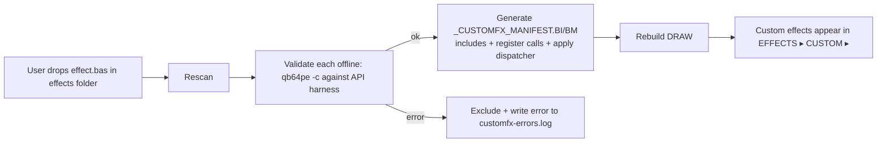

# DRAW Custom Effects SDK — Design Spec

> Status: **DESIGN / proposal** (2026-08-15). Nothing built yet — this is for
> review before implementation. Author: effect-parameterization session.

## Goal (from Rick)

A GIMP-Script-Fu-style system for **user-written custom effects**: separate
files on disk, written in **native QB64-PE**, that DRAW discovers, **validates
offline**, and **compiles in**; exposed in a **CUSTOM ▸** flyout at the bottom of
the EFFECTS menu. A real **DRAW API** exposes the same things the built-in
effects use — image/state, layers, palettes, selections, dialogs + dialog
widgets — plus a **registration hook**, a **naming system**, and a **preset
system** (save / load / rename / delete). **Docs and examples are first-class.**

## The core constraint (and why it's a feature)

QB64-PE is compiled to one executable; there is no embedded interpreter. So a
custom effect is **QB64 source** that gets included at build time. The lifecycle
is therefore:



This guarantees **only compiling, contract-valid effects ship** — a broken
custom effect can never crash DRAW because it never enters the build. The
tradeoff: adding/editing an effect needs a rebuild (~2 min), triggered by an
explicit **EFFECTS ▸ CUSTOM ▸ Rescan & Rebuild…** action (not every startup).

## Directory layout

```
~/.local/share/DRAW/effects/          # user effects (OS-native data dir; per gotcha PATHS)
  hello_tint.bas                       # one self-contained effect per file
  vhs_glitch.bas
  presets/
    vhs_glitch/                        # preset sets per effect (JSON-ish .cfg)
      strong.cfg
      subtle.cfg
ASSETS/EFFECTS/examples/               # shipped examples (read-only, in repo)
  01_color_tint.bas
  02_spatial_ripple.bas
  03_custom_dialog.bas
CUSTOMFX/                              # the SDK itself (in repo)
  CUSTOMFX-API.BI/BM                   # the stable API surface effects call
  CUSTOMFX-REGISTRY.BI/BM              # registration table + CUSTOM flyout wiring
  CUSTOMFX-VALIDATE.sh                 # offline validation (qb64pe -c per effect)
  CUSTOMFX-GENERATE.sh                 # scans folder -> _CUSTOMFX_MANIFEST.*
  _CUSTOMFX_MANIFEST.BI/BM             # GENERATED: includes + register + dispatch
  presets/…                            # preset storage helpers
```

## The Effect API contract

A custom effect is one `.bas` file with three parts. Minimal example:

```qb64
'$INCLUDEONCE
' hello_tint.bas — tint the layer toward FG colour.
' meta: name/category/label + declared params -> DRAW auto-builds the dialog.

SUB CUSTOMFX_register ()                       ' 1) REGISTRATION HOOK
    FX_begin "Hello Tint", "COLOR"             '   unique name + category
    FX_param_slider "AMOUNT", 0, 100, 50, "%"  '   auto dialog: sliders,
    FX_param_slider "HUE", 0, 359, 30, "deg"   '   toggles, colours…
    FX_param_toggle "PRESERVE LUMA", 0
    FX_param_color  "TINT", FX_FG              '   defaults from FG/BG/palette
    FX_end
END SUB

FUNCTION CUSTOMFX_apply& (src AS LONG)         ' 2) APPLY: src -> new image
    DIM w AS LONG, h AS LONG
    w = FX_width(src) : h = FX_height(src)
    DIM out AS LONG : out = FX_clone(src)       '   helper: copy w/ alpha
    DIM amt AS SINGLE : amt = FX_slider("AMOUNT") / 100.0
    DIM tint AS _UNSIGNED LONG : tint = FX_color("TINT")
    DIM x AS LONG, y AS LONG, p AS _UNSIGNED LONG
    FOR y = 0 TO h - 1
      FOR x = 0 TO w - 1
        p = FX_get(src, x, y)                   '   per-pixel read (RGBA)
        IF FX_alpha(p) = 0 THEN _CONTINUE       '   respect transparency
        FX_put out, x, y, FX_lerp(p, tint, amt) '   write result
      NEXT
    NEXT
    CUSTOMFX_apply& = out                        '   DRAW composites/undoes it
END FUNCTION
```

DRAW handles everything else: the dialog (from the declared params, with live
loupe preview, mouse-wheel sliders, OK/RESET/CANCEL, presets), multi-layer
targeting, selection clipping, history/undo, and menu placement. The author
writes only *what the effect does*.

### API surface (`FX_*` — the "DRAW API")

Stable, versioned (`FX_API_VERSION`), documented. Grouped:

- **Registration** — `FX_begin name$, category$`, `FX_param_slider/toggle/color/list`, `FX_end`. Category is one of the built-in flyouts or a custom sub-name.
- **Params (read in apply)** — `FX_slider(name$)`, `FX_toggle(name$)`, `FX_color(name$)`, `FX_choice(name$)`.
- **Image** — `FX_width/height(img)`, `FX_clone(img)`, `FX_new(w,h)`, `FX_get(img,x,y)→RGBA`, `FX_put img,x,y,rgba`, plus `FX_mem(img)` for `_MEM` power users. Colour helpers `FX_red/green/blue/alpha`, `FX_rgba`, `FX_lerp`, `FX_valnoise` (shared deterministic noise).
- **State / context** — `FX_fg()`, `FX_bg()`, `FX_palette(i)`, `FX_palette_count()`, `FX_canvas_w/h()`, `FX_zoom()`.
- **Layers** — `FX_layer_count()`, `FX_layer_image(i)`, `FX_current_layer()`, `FX_layer_visible(i)`, `FX_layer_opacity(i)` (read-only for v1; effects return a result image for the *current* layer — multi-layer handled by DRAW).
- **Selection** — `FX_has_selection()`, `FX_in_selection(x,y)`, `FX_selection_mask()` (so an effect can *use* the selection as its shape — ties into the selection-as-base work).
- **Dialog widgets (advanced/opt-in)** — for effects that want a *custom* dialog instead of the auto one: `FX_dialog_begin`, `FX_draw_slider/toggle/label/button`, `FX_hit`, exposing the existing `DIALOG_*`/`IMGDLG_*` widgets behind stable names.
- **Presets** — `FX_preset_save/load/list/rename/delete` (DRAW's dialog exposes a preset dropdown + save/rename/delete UI, storing per-effect `.cfg` files).

### Two authoring tiers

1. **Declarative (GIMP-Fu-like, the default)** — declare params, write `apply`. DRAW auto-generates the dialog. ~90% of effects.
2. **Custom-dialog** — implement `CUSTOMFX_dialog%()` using `FX_dialog_*` widgets for bespoke UI (angle dials, multi-tab, etc.).

## Offline validation (the "stable effects" guarantee)

`CUSTOMFX-VALIDATE.sh <file>`:
1. Wrap the effect with an **API harness** (`CUSTOMFX-API.BI` stubs + a tiny main) and run `qb64pe -c` (compile-only) / the MCP `lint` Layer-A. Rejects: won't compile, wrong `CUSTOMFX_register`/`apply` signatures, reserved-word/gotcha violations (reuse the lint's regex rules), missing `FX_end`, `FX_API_VERSION` mismatch.
2. Static checks: duplicate effect names, disallowed calls (file I/O outside `FX_preset_*`, no `SYSTEM`/`SHELL`), image-handle hygiene.
3. Result → `customfx-errors.log` with file+line; invalid effects are **excluded** from the manifest (never built in).

## Manifest generation + rebuild

`CUSTOMFX-GENERATE.sh`:
- Scans the effects folder, validates each, and writes **`_CUSTOMFX_MANIFEST.BI`** (`'$INCLUDE` each valid effect, renaming `CUSTOMFX_register`/`apply` per-effect via a small preprocessor so many effects coexist) and **`_CUSTOMFX_MANIFEST.BM`** with:
  - `CUSTOMFX_register_all` → calls every effect's register (fills the registry + CUSTOM flyout).
  - `CUSTOMFX_dispatch& (fxId, src)` → `SELECT CASE fxId` routing to each effect's apply.
- DRAW's `EFFECTS ▸ CUSTOM ▸ Rescan & Rebuild…` runs generate → `make` → offers to relaunch. A CLI `make custom-effects` does the same headless.
- The **CUSTOM flyout** is populated at runtime from the registry (built by `register_all`), reusing the existing generic flyout system (categories/children already support this).

## Menu + registry integration

- Reuse the generic flyout: add a `catCustom% = register_submenu_parent("CUSTOM", …)`. `register_all` adds one child per effect (sub-grouped by the effect's declared category if desired). Action IDs allocated from a reserved **custom range 3000–3999** (well clear of built-ins; gotcha #17).
- Each custom effect's dialog is the shared IMGDLG dialog driven by its param spec — so it automatically gets the loupe preview, wheel sliders, RESET, selection-clip, and presets for free.

## Presets

- Per-effect `presets/<effectname>/<presetname>.cfg` (key=value of the declared params). Dialog shows a preset dropdown + **Save / Save As / Rename / Delete**. `FX_preset_*` API for effects that want programmatic access. Ships a `Default` preset from the declared defaults (RESET already covers that).

## Docs & examples (first-class)

- **`docs/CUSTOM-EFFECTS.md`** — SDK guide: quickstart, the full `FX_*` reference, the two tiers, validation rules, presets, the rebuild flow, troubleshooting.
- **Three shipped examples** (`ASSETS/EFFECTS/examples/`): `01_color_tint` (declarative colour), `02_spatial_ripple` (declarative spatial + selection-aware), `03_custom_dialog` (bespoke dialog + preset use). Each heavily commented.
- A **`draw new-effect <name>`** scaffolder that stamps a commented template.

## Phased roadmap

- **P1 — API + one effect, hardcoded include.** Build `CUSTOMFX-API.BI/BM`, the registry, the auto-dialog-from-paramspec, and ONE example wired in manually. Proves the contract end-to-end (dialog + apply + preview + undo + selection-clip).
- **P2 — Discovery + validate + generate + rebuild.** The scan/validate/manifest scripts + the `Rescan & Rebuild` menu action + CUSTOM flyout population.
- **P3 — Presets** (save/load/rename/delete) in the shared dialog.
- **P4 — Custom-dialog tier** (`FX_dialog_*`) + the two advanced examples.
- **P5 — Docs, scaffolder, polish**, and a QA harness path (validate the shipped examples in CI).

## Open questions for Rick (decisions that shape P1)

1. **Rebuild trigger** — explicit `Rescan & Rebuild…` menu action (proposed) vs. auto-detect-on-startup (heavier)?
2. **Effects folder** — OS-native data dir `~/.local/share/DRAW/effects/` (proposed, matches config migration) vs. a repo/portable folder?
3. **Auto-dialog vs. author-writes-dialog** — default to auto-generated from param specs (proposed, GIMP-Fu-like) with custom-dialog as opt-in?
4. **Sandbox strictness** — how locked-down should effects be (proposed: no `SHELL`/`SYSTEM`/arbitrary file I/O; image + declared params + `FX_preset_*` only)?
5. **Distribution** — just local files for now, or also a "share an effect" export/import (single `.bas`)?

---

## Prerequisite: Selection support (Rick: "finish selection first")

Decisions captured (2026-08-15): rebuild = **explicit menu action**; dialogs =
**auto-from-params + opt-in custom**; sandbox = **strict**; do **selection first**.

Selection-support status (branch `more-image-effects`):
- [x] **Clip to selection (apply-core)** — all ~70 effects restore original pixels
      outside the active selection (rect BOX or per-pixel SELECTION_MASK), wired
      into IMAGE_ADJ_apply_to_layer / apply_spatial, apron-aware. Guarded no-op
      when no selection (regression 22/22). Logic mirrors TOOLS/SELECTION.BM.
- [x] **SELECT-menu toggles** — "EFFECTS: CLIP TO SELECTION" (default on) /
      "EFFECTS: SELECTION AS SHAPE", checkbox state synced. (Kept out of the
      EFFECTS dropdown so its width — and the flyout nav — stays stable.)
- [ ] **Preview parity** — clip the loupe preview too so it matches the apply.
      Publish IMGADJ_LOUPE_CROPX/Y from update_loupe (declared, not yet set) and
      blend previewThumb→origThumb outside the selection in IMAGE_ADJ_mask_preview.
- [ ] **Selection-as-base mode** — EFFECT_SEL_AS_SHAPE currently only *disables*
      clipping. To make edge effects (Outline/Glow/Shadow/Backlight/Corona) radiate
      from the selection EDGE (inside + outside), the engine must see the selection
      as the shape's alpha. Preview side is doable in the shared update_loupe (set
      origThumb alpha = selection coverage). The APPLY side has **no shared choke
      point** (each dialog passes the layer straight to its engine), so it needs a
      small per-edge-effect change OR a shared "shaped source" wrapper — the one
      genuinely harder piece; do it deliberately, not at the tail of a long session.

> NOTE: automated selection QA is unreliable via the harness's flaky drag-marquee
> (confirmed in edit-stroke-selection.sh). Verify the clip interactively: draw a
> shape, marquee a region, apply any effect → only the region changes.
