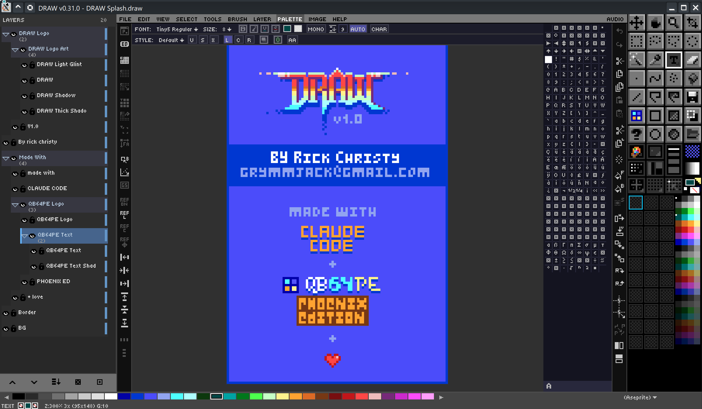

DRAW by Rick Christy <grymmjack@gmail.com>
==========================================

# REQUIRES QB64PE-v4.x+

```
DATA "XXXXXX  ", "XXXXXXXX", "XXXXXXXX", "XX  XX  XX", "  XX  XX  "
DATA "XX::::XX", "XX::::XX", "XX::::XX", "XX  XX  XX", "XX::  ::XX"
DATA "XX    XX", "XX  XX::", "XXXX  XX", "XX  XX  XX", "XX      XX"
DATA "XX    XX", "XX  ::XX", "XX::  XX", "XX  XX  XX", "XX      XX"
DATA "XXXXXXXX", "XX    XX", "XX    XX", "XXXX::XXXX", "::XX  XX::"
DATA "::::::::", "::    ::", "::    ::", "::::  ::::", "  ::  ::  "
```

DRAW is a pixel art editor written in QB64PE that can export images as sourcecode



## Features

### Drawing Tools
- **Brush** - Continuous freehand painting with adjustable size (1-50px) and shape (circle/square)
- **Dot** - Single-pixel stamp tool (click to place, no drag painting)
- **Line** - Draw straight lines
- **Rectangle** - Draw outlined or filled rectangles
- **Ellipse** - Draw outlined or filled ellipses/circles
- **Polygon** - Draw outlined or filled multi-point polygons
- **Fill** - Flood fill tool
- **Spray** - Spray paint with adjustable radius and density, SHIFT axis constraint, circle preview
- **Picker** - Color sampling/eyedropper
- **Marquee** - Rectangular selection with move and resize
- **Move** - Transform and position selected content
- **Pan** - Dedicated canvas panning tool (hand)
- **Zoom** - Click to zoom in, Alt+click to zoom out, drag to zoom region
- **Clipboard** - Copy/Cut/Paste selections (Ctrl+C/X/V), Clear selection (Ctrl+E)
- **Text** - Text entry tool
- **Crop** - Canvas crop/resize *(coming soon)*

### Grid System
- Adjustable grid overlay (2-50px spacing)
- Toggle grid visibility with `'` (apostrophe)
- Pixel grid for precise work at 400%+ zoom (`Shift+'`)
- Snap-to-grid mode with `;` (semicolon)
- Dynamic grid sizing with `.` (increase) and `,` (decrease)
- Both grids can be shown simultaneously at high zoom
- Status bar indicator shows grid size and snap state

### Color System
- **Dynamic Palette System** - Load palettes from .GPL files (GIMP Palette format)
- **Palette Strip** - Shows current palette colors with scroll arrows for large palettes
- **Palette Dropdown** - Click palette name to switch between available palettes
- **Left-click swatch** - Select foreground color
- **Right-click swatch** - Select background color
- **Mouse wheel on strip** - Scroll through palette colors
- **SHIFT + wheel** - Fast scroll (32 colors at a time)
- Custom color picker with true RGB support
- Click status bar FG/BG swatches to open color picker
- Keyboard shortcuts 0-9, !, @, #, $, %, ^, & for quick color access

### Canvas & View
- 320x200 default canvas size
- Clear canvas: `Delete` (with prompt) or `Backspace` (instant)
- Infinite zoom levels (mouse wheel or Ctrl +/-)
- Pan with middle mouse button or spacebar + drag
- Keyboard panning with arrow keys
- Reset view with Ctrl+0 or double-click middle mouse
- Toggle UI elements (toolbar, status bar)

### Brush System
- Size adjustment: `[` decrease, `]` increase (1-50px)
- Shape toggle: `\` or `|` (circle/square)
- Preview mode: `` ` `` or `~` (shows outline + color preview)
- Pixel perfect mode: `F6` (removes L-corners for cleaner strokes)
- 4 brush presets (F1-F4)
- Visual cursor feedback with current color

### Layer System
- Up to 32 layers with per-layer opacity, visibility, and blend mode
- **19 blend modes**: Normal, Multiply, Screen, Overlay, Add, Subtract, Difference, Darken, Lighten, Color Dodge, Color Burn, Hard Light, Soft Light, Exclusion, Vivid Light, Linear Light, Pin Light, Color, Luminosity
- Solo layer (Alt+click eye icon) and visibility swipe (drag across eye icons)
- Drag-and-drop layer reordering with visual feedback
- Opacity lock, merge down, merge visible, duplicate
- CTRL+Click layer to create selection from non-transparent pixels
- DRW project format preserves layers, blend modes, opacity, and all tool states

### User Interface
- Themeable PNG icon toolbar (21 buttons in 3×7 grid)
- PNG cursors with theme-configurable hotspots and alpha transparency
- Layer panel with PNG icons (visibility, lock, action buttons)
- Auto-hiding toolbar and status bar during active drawing
- Manual UI toggle with Tab, F10, F11
- Status bar shows: tool, coordinates, zoom, grid state, colors
- Smooth zoom and pan
- Help button opens searchable command palette

## Quick Start

### Essential Controls

**Tools:** B (Brush), D (Dot/Stamp), F (Fill), I (Picker), K (Spray), L (Line), R (Rectangle), E (Ellipse), Z (Zoom)  
**Colors:** Left-click palette swatch for FG, Right-click for BG, or use 0-9 keys  
**Palette:** Click palette name dropdown to switch palettes, SHIFT+wheel for fast scroll  
**Grid:** `'` (toggle), `Shift+'` (pixel grid), `;` (snap), `.` (bigger), `,` (smaller)  
**Brush Size:** `[` (smaller), `]` (bigger), F6 (pixel perfect)  
**Canvas:** Delete (clear with prompt), Backspace (clear instant)  
**View:** Mouse wheel (zoom), Middle click (pan), Ctrl+0 (reset)  
**Clipboard:** Ctrl+C (copy), Ctrl+X (cut), Ctrl+V (paste at cursor), Ctrl+E (clear)  
**Undo/Redo:** Ctrl+Z / Ctrl+Y

See [CHEATSHEET.md](CHEATSHEET.md) for complete controls reference.

## Command Line

DRAW can be launched with a file argument to automatically load an image or project:

```bash
# Load a DRAW project file
./DRAW.run myproject.draw

# Load an image file (PNG, BMP, JPG, GIF)
./DRAW.run image.png

# File paths with spaces need quotes
./DRAW.run "path/to/my image.png"
```

Supported formats:
- **.draw** - DRAW project files (preserves layers, blend modes, palette, tool states)
- **.png, .bmp, .jpg, .jpeg, .gif** - Image files (loads into current layer)

## Building

```bash
qb64pe -w -x -o DRAW.run DRAW.BAS
```

## Installation

Each platform has an installer that registers `.draw` file associations, installs app icons, and creates launcher entries.

### Linux

```bash
chmod +x install-linux.sh
./install-linux.sh
```

Installs a `.desktop` launcher, registers the `application/x-draw-project` MIME type for `.draw` files, and installs icons into the hicolor theme. To uninstall:

```bash
./install-linux.sh --uninstall
```

### Windows

Right-click `install-windows.cmd` and select **Run as administrator** (or run from an elevated command prompt). Registers the `.draw` file association in the registry with the DRAW icon and adds a Start Menu shortcut. To uninstall:

```cmd
install-windows.cmd /uninstall
```

### macOS

```bash
chmod +x install-mac.command
./install-mac.command
```

Or double-click `install-mac.command` in Finder. Creates a `DRAW.app` bundle in `~/Applications`, registers `.draw` file associations via LaunchServices, and sets the app icon. To uninstall:

```bash
./install-mac.command --uninstall
```

> **macOS users:** There are platform-specific input differences on macOS. See [MAC-USERS-README.md](MAC-USERS-README.md) for details on Ctrl+Click behavior, Command key limitations, and Parallels compatibility.

## License

See LICENSE file for details.

