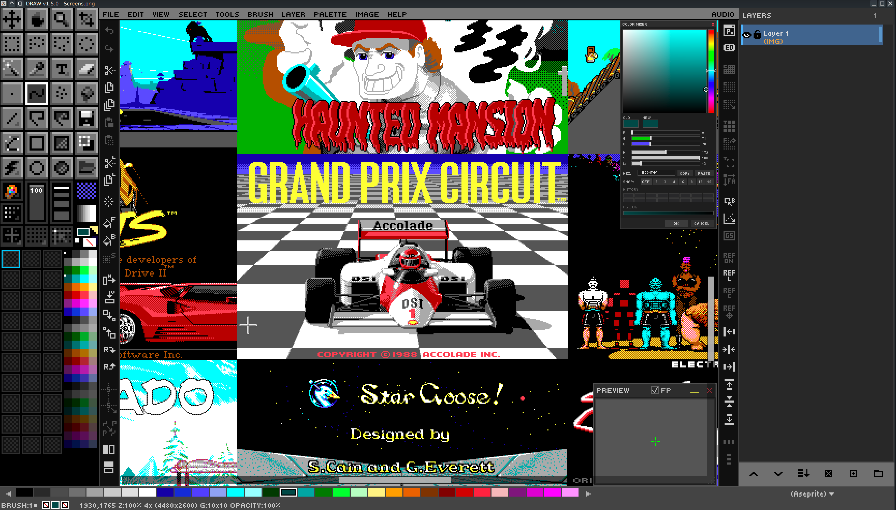

DRAW by Rick Christy <grymmjack@gmail.com>
==========================================

# REQUIRES QB64PE-v4.x+

```
DATA "XXXXXX  ", "XXXXXXXX", "XXXXXXXX", "XX  XX  XX", "  XX  XX  "
DATA "XX::::XX", "XX::::XX", "XX::::XX", "XX  XX  XX", "XX::  ::XX"
DATA "XX    XX", "XX  XX::", "XXXX  XX", "XX  XX  XX", "XX      XX"
DATA "XX    XX", "XX  ::XX", "XX::  XX", "XX  XX  XX", "XX      XX"
DATA "XXXXXXXX", "XX    XX", "XX    XX", "XXXX::XXXX", "::XX  XX::"
DATA "::::::::", "::    ::", "::    ::", "::::  ::::", "  ::  ::  "
```

DRAW is a pixel art editor written in QB64PE that can export images as sourcecode

Current release: v0.25.0



## Features

### Drawing Tools
- **Brush** - Continuous freehand painting with adjustable size (1-50px) and shape (circle/square)
- **Dot** - Single-pixel stamp tool (click to place, no drag painting)
- **Line** - Draw straight lines with brush size/shape, real-time thick preview, angle snapping
- **Rectangle** - Draw outlined or filled rectangles with brush size/shape; filled mode supports custom brush tiled fill and drawer paint modes with interactive Fill Adjustment (`F8`)
- **Ellipse** - Draw outlined or filled ellipses/circles with brush size/shape; filled mode supports custom brush tiled fill and drawer paint modes with interactive Fill Adjustment (`F8`)
- **Polygon** - Draw outlined or filled multi-point polygons with brush size/shape, angle snapping; filled mode supports custom brush tiled fill and drawer paint modes with interactive Fill Adjustment (`F8`)
- **Fill** - Flood fill tool; hold **Shift** to sample from merged visible canvas while painting onto the current layer; supports custom brush tiled fills and drawer paint mode fills with interactive Fill Adjustment overlay (`F8`)
- **Spray** - Spray paint with brush-shaped nozzle tips, radius doubles per brush size level, custom brush stamp support, SHIFT axis constraint, circle preview
- **Picker** - Color sampling/eyedropper with a cursor-adjacent loupe overlay that shows RGB and hex values; hold ALT with any tool for temporary picker; ALT+left picks FG, ALT+right picks BG
- **Marquee** - Selection tools: Rectangle, Freehand, Polygon, Ellipse — each with a distinct crosshair cursor
- **Magic Wand** - Select contiguous same-color pixels with dedicated crosshair cursor; **Hold `F`+click to flood fill** contiguous pixels with FG color; **Hold `E`+click to flood erase** to transparent; **Hold `W`+click to select from merged** (all visible layers)
- **Move** - Transform and position selected content with arrow keys, undo support, and ALT+drag clone stamping
- **Transform** - Universal flip H/V, rotate 90° CW/CCW, scale ±50% — works on layers, selections, or floating moves from any tool; **Edit → TRANSFORM...** opens an interactive on-canvas bounding-box overlay with five modes: Scale (Shift=lock aspect), Rotate (Shift=15° snap), Shear, Distort, and Perspective (Shift=wall projection); overlay frame and handle colours are fully themeable; previous tool is restored on apply/cancel
- **Pan** - Dedicated canvas panning tool (hand)
- **Zoom** - Click to zoom in, Alt+click to zoom out, drag to zoom region
- **Clipboard** - Copy/Cut/Paste selections (Ctrl+C/X/V), Merged copy (Ctrl+Shift+C), Clear selection (Ctrl+E); mask-aware operations for magic wand and non-rectangular selections
- **Text** - Text entry tool with text layers, font properties bar (VGA/Tiny5/custom TTF/OTF/bitmap), rich per-character formatting (bold/italic/underline/strikethrough), per-character FG/BG colors, cursor navigation, selection, clipboard, auto-wrap, and sound feedback; text layers persist in DRW files with full undo/redo support; click existing text layers to re-edit; **Character Mode** for ANSI/ASCII art with PabloDraw-style virtual cursor navigation, F1-F12 block character shortcuts, and font stickiness
- **Character Map** - Dockable 16×16 glyph panel (`Ctrl+M`) showing all 256 font characters with hover/select/flash states; supports bitmap font rendering (Fontaption, PSF, BDF formats); click glyphs to insert or stamp as custom brush; Alt+U picks FG/BG colors from character under cursor; character grid overlay with snap-to-grid for precise text art alignment
- **Eraser** - Dedicated eraser tool that paints transparent; shares brush size preview and custom brush support. **Smart Erase** (hold `Shift` while erasing) erases on every visible non-opacity-locked layer simultaneously
- **Stroke Selection** - Apply a configurable stroke (inside/outside/center, adjustable width) around the active selection boundary via Edit → Stroke Selection
- **Custom Brush** - Capture selection as reusable brush with flip/scale transforms, non-rectangular shapes via alpha channel, dynamic outline expansion
- **Reference Image** - Load a high-res image behind the canvas at adjustable opacity for tracing (`Ctrl+R` toggle, `Ctrl+Shift+Wheel` opacity, reposition via View menu); state persisted in `.draw` project files
- **Image Import** - Load images with interactive placement, rotation (90° CW/CCW), horizontal/vertical flip, zoom, pan, and resize — with live preview of all transformations
- **Crop** - Interactive canvas crop using marquee selection with dark overlay, resize handles, and size label; also supports canvas resize dialog
- **Canvas Resize** - Resize canvas to arbitrary dimensions via dialog (Canvas menu), preserving layer content at origin
- **New from Template** - Start fresh from bundled `.draw`/image templates or a remembered template folder
- **QB64 Export** - Generate QB64 source output from artwork/history, with improved raster fallback for operations that cannot be reproduced parametrically
- **Angle Snap** - Two modes: degree-based (configurable 15°/30°/45°/90° increments) and pixel-art (11 integer-ratio angles for clean pixel lines). Hold Ctrl+Shift to snap + bypass grid. Applies to Line, Polygon, and Brush/Dot connecting lines
- **Image Adjustments** - Non-destructive per-layer adjustments via the Image menu: Brightness/Contrast, Hue/Saturation, Levels, Color Balance, Blur, Sharpen, Invert, Desaturate, Posterize, Pixelate — all with **live preview** and **mouse wheel slider** support; Posterize also supports multiple dithering algorithms; alpha channel preserved throughout
- **Extract Images** - Extract individual sprites or components from sprite sheets or multi-layer artwork as separate PNG files (File → Extract Images); supports transparent/FG color/BG color background modes, connected-component flood fill for single-layer sheets, per-layer or merged extraction for multi-layer files, configurable output naming and dimensions; extraction settings persisted in `.draw` project files

### Grid System
- Adjustable grid overlay (2-50px spacing)
- Toggle grid visibility with `'` (apostrophe)
- Pixel grid for precise work at 400%+ zoom (`Shift+'`)
- Snap-to-grid mode with `;` (semicolon)
- **4 grid geometry modes**: Square, Diagonal (45°), Isometric (2:1 pixel art, 26.565°), Hexagonal — cycle with `Ctrl+'`
- **Ctrl+Shift bypasses grid snap** for freehand placement when snap-to-grid is enabled
- Grid alignment modes: Corner (snap to intersections) or Center (snap to cell centers) — toggle via View menu
- **Grid cell fill mode**: Fill tool fills individual grid cells (squares, diamonds, triangles, or hexagons) instead of flood fill — toggle via View menu
- Dynamic grid sizing with `.` (increase) and `,` (decrease)
- Both grids can be shown simultaneously at high zoom
- Configurable grid/pixel grid/crosshair color, opacity, and angle via DRAW.cfg
- Crosshair assistant lines with configurable outline stroke (color, opacity, width) for improved visibility against any background
- Configurable transparency checkerboard colors and size
- Status bar indicator shows grid size, mode, and snap state

### Color System
- **Dynamic Palette System** - Load palettes from .GPL files (GIMP Palette format)
- **Palette Strip** - Shows current palette colors with scroll arrows for large palettes
- **Palette Dropdown** - Click palette name to switch between available palettes
- **Palette Workflows** - Load downloadable palettes from Lospec, create palettes from images, remap artwork to the active palette, and optionally include downloaded/user-created palettes in the picker
- **Left-click swatch** - Select foreground color
- **Right-click swatch** - Select background color
- **Mouse wheel on strip** - Scroll through palette colors
- **SHIFT + wheel** - Fast scroll (32 colors at a time)
- Custom color picker with true RGB support
- Click status bar FG/BG swatches to open color picker
- Keyboard shortcuts 0-9, !, @, #, $, %, ^, & for quick color access

### Canvas & View
- Configurable canvas size (up to 4096x4096)
- Clear canvas: `Delete` (with prompt) or `Backspace` (instant)
- Infinite zoom levels (mouse wheel or Ctrl +/-)
- Pan with middle mouse button or spacebar + drag
- Scrollbars for canvases larger than the viewport
- Keyboard panning with arrow keys
- Reset view with Ctrl+0 or double-click middle mouse
- **Preview Window** - Floating preview with two modes: Follow (magnifier) and Floating Image (load a reference image); Bin Quick Look previews drawer slot contents on hover; Color Picking with Alt+Click; Recent Preview Images submenu; independent zoom/pan, move/resize controls, and persistent state (`F4`)
- **Pattern Tile Mode** - 3×3 tiled canvas preview for seamless work on canvases up to 512×512 (`Shift+Tab`)
- Toggle UI elements (toolbar, status bar, menu bar, layer panel, preview window, edit bar)

### Brush System
- Size adjustment: `[` decrease, `]` increase (1-50px)
- Shape toggle: `\` or `|` (circle/square)
- Preview mode: `` ` `` or `~` (shows outline + color preview)
- Pixel perfect mode: `F6` (removes L-corners for cleaner strokes)
- 4 brush size presets via the organizer widget and command palette
- Visual cursor feedback with current color

### Layer System
- Up to 64 layers with per-layer opacity, visibility, and blend mode
- **19 blend modes**: Normal, Multiply, Screen, Overlay, Add, Subtract, Difference, Darken, Lighten, Color Dodge, Color Burn, Hard Light, Soft Light, Exclusion, Vivid Light, Linear Light, Pin Light, Color, Luminosity
- Solo layer (Alt+click eye icon) and visibility swipe (drag across eye icons)
- Drag-and-drop layer reordering with visual feedback
- Opacity lock prevents drawing on transparent pixels (enforced by all drawing tools including shape tools)
- Select from current layer: Ctrl+Click a layer row to create a selection mask from its non-transparent pixels
- Merge down, merge visible, **merge selected** (composites all multi-selected layers into one), duplicate layers
- **Multi-layer select**: Ctrl+Click or Shift+Click layer rows to add/remove layers from the selection; Edit menu operations (clear, fill FG/BG, flip H/V, scale ±50%, rotate CW/CCW) apply to all selected layers simultaneously
- **Select → From Current Layer**: creates a marquee selection mask from all non-transparent pixels on the current layer
- **Select → From Selected Layers**: creates a union selection mask from all non-transparent pixels across every selected layer (requires 2+ selected)
- **Recent Files** - File menu tracks up to 10 recently opened projects with submenu navigation and `Alt+1`–`Alt+0` keyboard shortcuts
- DRW project format: PNG with embedded `drAw` chunk — preserves layers, blend modes, opacity, palette, tool states, grid state, reference image configuration, and extract images settings while remaining viewable in any image viewer

### Sound System
- **21 categorized sound slots** covering menus, tools, selections, fill, clipboard, layers, text, sliders, drag-drop, point placement, and organizer interactions
- All sounds loaded from `ASSETS/THEMES/DEFAULT/SOUNDS/` — fully replaceable per theme via `THEME.CFG`
- Per-operation sound triggers: SND_POINT on every click/vertex, SND_DRAG_DROP on shape commit, SND_SELECTION looped during selection drags, SND_SLIDER on opacity wheel/release, SND_ORGANIZER on organizer widget click/wheel
- `SOUND_loop` / `SOUND_stop` for collision-free per-frame looping sounds (selection drag)
- SFX enable/disable, volume (0–100%), and mute configurable independently in `DRAW.cfg`

### Music System
- **Background music** — plays random tracker files (`.mod`, `.xm`, `.it`, `.s3m`, `.rad`) from `ASSETS/THEMES/DEFAULT/MUSIC/`
- **Auto-shuffle** — picks a new random track when the current one ends; avoids repeating the last track
- **Dedicated AUDIO root menu** (rightmost in the menu bar) — separate controls for SFX and music: toggle, volume up/down (±10%), mute toggle, **Explore Music Folder**, and live **NOW PLAYING** status
- Music volume and mute are independent of SFX volume and mute
- All audio state persisted in `DRAW.cfg` (`SOUNDS_ENABLED`, `SOUNDS_VOLUME`, `SOUNDS_MUTED`, `MUSIC_ENABLED`, `MUSIC_VOLUME`, `MUSIC_MUTED`)

### User Interface
- **Drawer panel** - A 30-slot drawer beneath the organizer for brush, gradient, and pattern sets (including 1-bit patterns with opaque background support); `F1`/`F2`/`F3` switch modes, left-click selects, `Shift+Left Click` stores, right-click opens a context menu, middle-click cycles modes, `Shift+Middle Click` clears a slot, `Shift+Right Click` imports into a slot, and drag-and-drop to reorder bins
- **Character map panel** - Dockable left/right 16×16 glyph grid with dynamic cell count (4-16 per row), mouse wheel scrolling, configurable theme colors, and bitmap font rendering
- **Preview window** - A floating preview panel with two modes: **Follow** (canvas magnifier following the pointer) and **Floating Image** (display a loaded reference image); supports **Bin Quick Look** (hover drawer slots to preview brush/pattern/gradient), **Color Picking** (Alt+Click to sample colors from preview), and **Recent Preview Images** (up to 10 recently loaded images); pan/zoom, minimize/close buttons, and work-area clamping
- **Edit bar** - A dockable vertical strip of edit-action icons on the left or right side of the workspace (`F5`)
- **Layout docking** - Toolbox, layer panel, and edit bar can each be docked to the left or right side of the workspace via View → Layout menu or `Ctrl+Shift+Click` on the panel
- **System cursors** - Automatically uses OS native cursors for UI areas (arrow in toolbar/panels), canvas work (crosshair for drawing tools, I-beam for text, resize arrows for handles) and move tool (move pointer); falls back to custom PNG cursors for tools that need them (brush, fill, picker loupe, spray, marquee); configurable via `SYSTEM_CURSORS` in `DRAW.cfg`
- Themeable PNG icon toolbar (28 buttons in **4×7 grid**)
- PNG cursors with theme-configurable hotspots and alpha transparency
- **Fully themeable layer panel** — all colors, header height, and button bar height configurable via `ASSETS/THEMES/DEFAULT/THEME.CFG` (no recompile needed)
- **Menu bar** with File, Edit, View, Select, Tools, Brush, Layer, Palette, Image, Help, and Audio menus plus full keyboard navigation
- Submenus auto-position within menu bar bounds (no toolbar/panel overlap)
- Auto-hiding toolbar and status bar during active drawing
- Manual UI toggle with Tab, F10, F11 — toggling panels does not shift the canvas
- Status bar shows: tool, coordinates, zoom, grid state, colors
- Smooth zoom and pan
- Help button opens searchable command palette
- **Tooltips** - Hover hints for toolbar buttons, organizer widgets, and drawer mini palette; toggleable via Help menu → Show Tooltips

## Quick Start

### Essential Controls

**Tools:** B (Brush), D (Dot/Stamp), F (Fill), I (Picker), K (Spray), L (Line), R (Rectangle), C (Ellipse), E (Eraser), Z (Zoom)  
**Drawing:** Left-click draws with FG color, Right-click draws with BG color (all drawing tools)  
**Colors:** Left-click palette swatch for FG, Right-click for BG, hold ALT for temporary eyedropper, Ctrl+D (reset defaults), Shift+Delete (BG transparent)  
**Palette:** Click palette name dropdown to switch palettes, SHIFT+wheel for fast scroll  
**Grid:** `'` (toggle), `Shift+'` (pixel grid), `;` (snap), `Ctrl+'` (cycle mode), `.` (bigger), `,` (smaller)  
**Brush Size:** `[` (smaller), `]` (bigger), F6 (pixel perfect)  
**Panels:** F4 (preview), F5 (edit bar), Tab/F10/F11 (UI), Shift+Tab (pattern tile)  
**Canvas:** Delete (clear with prompt), Backspace (clear instant)  
**View:** Mouse wheel (zoom), Middle click (pan), Ctrl+0 (reset)  
**Clipboard:** Ctrl+C (copy), Ctrl+X (cut), Ctrl+V (paste at cursor), Ctrl+E (clear)  
**Files:** Ctrl+N (new), Alt+O (open .draw), Ctrl+S (save), Ctrl+Shift+S (save as), Alt+X (exit)  
**Reference:** Ctrl+R (toggle), Ctrl+Shift+Wheel (opacity)  
**Undo/Redo:** Ctrl+Z / Ctrl+Y

See [CHEATSHEET.md](CHEATSHEET.md) for complete controls reference.

## Command Line

DRAW can be launched with a file argument to automatically load an image or project:

```bash
# Load a DRAW project file
./DRAW.run myproject.draw

# Load an image file (PNG, BMP, JPG, GIF)
./DRAW.run image.png

# File paths with spaces need quotes
./DRAW.run "path/to/my image.png"
```

Supported formats:
- **.draw** - DRAW project files (preserves layers, blend modes, palette, tool states)
- **.png, .bmp, .jpg, .jpeg, .gif** - Image files (loads into current layer)

### Command Line Options

| Argument | Description |
|----------|-------------|
| `--config <file>` / `-c <file>` | Load a specific config file instead of the default |
| `--config-upgrade` | Reconcile existing config with latest defaults (adds missing keys) |

```bash
# Use a specific config file
./DRAW.run --config DRAW.macOS.cfg

# Short form
./DRAW.run -c DRAW.linux.cfg

# Upgrade an existing config with new default settings
./DRAW.run --config-upgrade

# Upgrade a specific config file
./DRAW.run -c DRAW.macOS.cfg --config-upgrade

# Combine with a project file
./DRAW.run -c DRAW.macOS.cfg myproject.draw
```

### OS-Specific Configuration

DRAW automatically detects the operating system and looks for a platform-specific config file before falling back to `DRAW.cfg`:

| OS | Config File | Fallback |
|----|-------------|----------|
| macOS | `DRAW.macOS.cfg` | `DRAW.cfg` |
| Linux | `DRAW.linux.cfg` | `DRAW.cfg` |
| Windows | `DRAW.windows.cfg` | `DRAW.cfg` |

**Priority order:** `--config` argument > OS-specific config > `DRAW.cfg`

This allows you to maintain separate configurations per platform (e.g., different display scales, toolbar sizes) while sharing the same project directory across platforms.

### Auto-Detection

On first launch (or when no config file exists), DRAW auto-detects optimal settings:

- **Display scale** — Targets 90% of desktop, picks highest integer scale up to 4x where the viewport fits (manual override via `DISPLAY_SCALE` supports up to 8x)
- **Toolbar scale** — Calculated from viewport height (>=800px=4x, >=600px=3x, >=400px=2x, else 1x)
- **Screen dimensions** — Viewport = 90% of desktop ÷ scale, rounded to even pixels
- All auto-detected values are saved to the config file for consistent subsequent launches

## Building

```bash
qb64pe -w -x -o DRAW.run DRAW.BAS
```

## Installation

Install scripts are in the `INSTALL/` directory. Each platform has an installer that registers `.draw` file associations, installs app icons, and creates launcher entries.

### Linux

```bash
chmod +x INSTALL/install-linux.sh
INSTALL/install-linux.sh
```

Installs a `.desktop` launcher, registers the `application/x-draw-project` MIME type for `.draw` files, and installs icons into the hicolor theme. To uninstall:

```bash
INSTALL/install-linux.sh --uninstall
```

### Windows

Right-click `INSTALL\install-windows.cmd` and select **Run as administrator** (or run from an elevated command prompt). Registers the `.draw` file association in the registry with the DRAW icon and adds a Start Menu shortcut. To uninstall:

```cmd
INSTALL\install-windows.cmd /uninstall
```

### macOS

Download `DRAW-osx-x64.tar.gz` from [Releases](https://github.com/grymmjack/DRAW/releases/latest), then run the install script (or double-click it in Finder):

```bash
chmod +x INSTALL/install-mac.command
INSTALL/install-mac.command
```

This downloads the latest release archive from GitHub and extracts it to `~/Applications/DRAW/`. To uninstall:

```bash
INSTALL/install-mac.command --uninstall
```

> **macOS users:** See [INSTALL/MAC-USERS-README.md](INSTALL/MAC-USERS-README.md) for platform-specific notes on quarantine, Ctrl+Click behavior, and Parallels compatibility.

## License

See LICENSE file for details.

