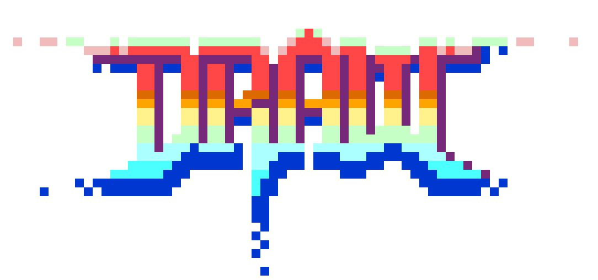
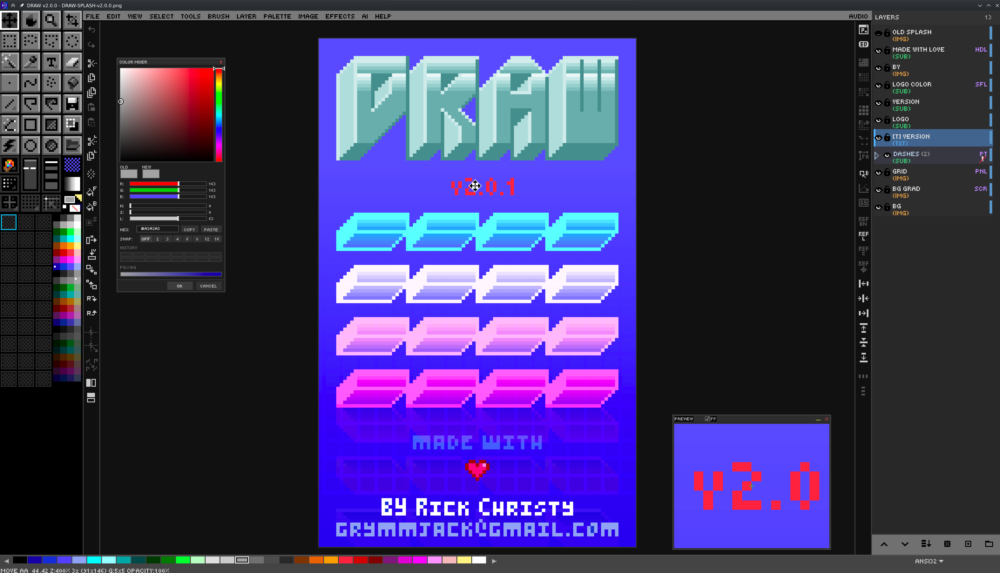

DRAW by Rick Christy <grymmjack@gmail.com>
==========================================



DRAW is a pixel art editor written in QB64PE that can export images as sourcecode

Current release: v2.0.2



## New in 2.0.2

An effects-cluster polish pass — the whole EFFECTS pipeline got the fit-and-finish it
was missing, plus a batch of text, cursor, and drawing fixes from field testing.

- **Effects remember their settings** — every effect keeps three parameter sets: **Defaults** (RESET restores them), **Last Set** (restored when you reopen the dialog), and **Last Applied** (**Redo Last Effect / `Ctrl+F`** re-applies it silently, **Recall / `Ctrl+Alt+F`** reopens it pre-filled).
- **Inside / Outside masking** — Wind, Wave Ripple, and Extrude expose `[x] Inside` `[x] Outside` toggles so an effect can clip to the silhouette, spill only outside it, or cover the whole layer; the dialog preview now matches the applied result.
- **Synthwave Render Grid** — Grid → Perspective is now a true 1980s vapor-synth floor grid (a wide projected plane converging to a vanishing point) with **ZOOM / ELEVATION / ROTATION** camera sliders, instead of the old truncated horizon box.
- **Effect fixes** — Backlight now applies (not just previews); Wind spills the shape's colour past its edge; Crystallize/Add Noise previews are anchored correctly at every zoom; running an effect on a **text layer auto-rasterizes it first** (a single `Ctrl+Z` restores the editable text).
- **Angle dials** — double-click any effect angle dial to type an exact value instead of only dragging.
- **Selection controls moved** — "Clip to Selection" and "Selection as Shape" now live in the **Effects** menu (clearly labelled), and shape/texture effects honour an active selection.
- **Text tool** — per-character selection follows a raised/lowered baseline; underline and strikethrough scale with font size; a font change undoes cleanly and stays in sync when you re-edit.
- **Cursor & marquee** — resize-corner cursors flip correctly on the right-side corners; hold **`Space`** while dragging out a marquee to reposition it without resizing.
- **Apron drawing** — a stroke started on the apron (the area just outside the canvas) now begins cleanly at the canvas edge instead of being dropped.

## New in 2.0.1

A stability patch — a deep bug-hunt closed 40+ defects across undo/redo, layer
groups, transform/move, export, importers, and input handling.

- **Crash fix** — dragging an off-canvas magic-wand selection no longer crashes (Critical Error #300 "Memory region out of range"); crash notices are now non-blocking instead of a modal you had to dismiss.
- **Transform Selection** — warp just the selection mask (Photoshop-style) from **Select → Transform…**, a flyout with all five modes (Scale, Rotate, Shear, Distort, Perspective); Distort now honors inward (concave) drags.
- **Undo/redo correctness** — layer group membership survives undo intact; a visibility/opacity change after an undo no longer strands a stale redo; palette edits undo cleanly with no phantom states.
- **No data loss** — mask-aware transform keeps pixels outside the selection; Merge Down/Visible preserves text-layer content; off-canvas transform/move results grow an apron instead of clipping.
- **Export & AI** — group-aware flatten (hidden-group children included), Export Selection honors apron + hidden groups, ANSI selection export honors non-rectangular masks, QB64 code export copies fonts natively on Windows; AI generate/batch can't write to the wrong layer if layers change mid-generation.

## New in 2.0.0

- **Massive Effects system** — a full Photoshop / Alien-Skin "Eye Candy"-style **EFFECTS** menu: SHAPE effects (Fire, Smoke, Snow, Water Drops, Electrify, Glass, Drip, Icicles, Motion Trail, Corona, Backlight, Cutout, Bevel, Chrome), TEXTURE engines (Wood, Marble, Brick, Weave, Reptile, Stone Wall, Diamond Plate, Lightning, Brushed Metal, Ripples, Fur, Rust), and RENDER engines (Sky, Grid, Terrain, Clouds, Lens Flare, Kaleidoscope) — every dialog with a live split preview, wheel sliders, an angle **dial**, **seed**, **MIX** (blend-with-original), and **Reset-to-Default**; effects can be **clipped to a selection** or run **selection-as-shape**.
- **Anti-Aliasing mode** (default OFF, per-document) — soft, coverage-blended edges for Brush/Dot, Line, Ellipse, Poly-line, Bezier, Poly-fill, all Smart Shapes, and a soft **coverage-subtract Eraser**; toggle from Edit → Anti-Aliasing or the shared Edit Bar **Edge-Mode** button (Pixel-Perfect ⟷ AA). AA off is byte-for-byte identical to before.
- **Kits** — export/install asset **kits** (ZIP bundles of fonts, palettes, brushes, and themes) with a manifest, per-type item picker, and headless export/install flags.
- **Multiple instances** — run isolated DRAW windows with a shared clipboard and **Copy/Paste/Send Layer** between them; background music plays only in the primary window.
- **Target-aware drag-and-drop** — drop an image on the canvas (stamp), the layer panel (new layer), the brush bin (custom brush), or the menu bar (open in a new window).
- **OS hardware cursor** — icon cursors via `_MOUSECURSOR` for render-free canvas moves (toggle in Settings).
- **Live theming** — a DARK theme, instant theme switching with no restart (`Ctrl+Shift+F5` to reload), and a `/create-draw-theme` workflow.
- **User-installable fonts** — TDF / bitmap / Color Bitmap fonts with preview strips in the pickers.
- **Config & CLI** — `--option KEY=VALUE` overrides and a `--options-list` registry; OS-enforced min/max window size (HiDPI-aware).

## Features

### Drawing Tools
- **Brush** - Continuous freehand painting with adjustable size (1-50px) and shape (circle/square)
- **Dot** - Single-pixel stamp tool (click to place, no drag painting)
- **Line** - Draw straight lines with brush size/shape, real-time thick preview, angle snapping; while dragging press `Right`/`Left` to add/remove radial spokes from the midpoint (up to 16)
- **Rectangle** - Draw outlined or filled rectangles with brush size/shape; filled mode supports custom brush tiled fill and drawer paint modes with interactive Fill Adjustment (`F8`); while dragging press `Right`/`Left` to add/remove column dividers and `Down`/`Up` for row dividers (up to 32 per axis, creating an interior grid)
- **Ellipse** - Draw outlined or filled ellipses/circles with brush size/shape; filled mode supports custom brush tiled fill and drawer paint modes with interactive Fill Adjustment (`F8`); while dragging press `Right`/`Left` to add/remove radial spokes and `Down`/`Up` for concentric inner rings (up to 16 each)
- **Polygon** - Draw outlined or filled multi-point polygons with brush size/shape, angle snapping; filled mode supports custom brush tiled fill and drawer paint modes with interactive Fill Adjustment (`F8`)
- **Bezier** (`Q`) - Draw cubic bezier curves: click to drop corner anchors, click+drag to drop smooth anchors with shaped handles; `H` toggles handle visualisation while editing, `Backspace` removes the last anchor, `Enter` commits, `Escape` cancels
- **Smart Shapes** - Parametric shape group accessed via the toolbar Smart Shapes flyout (long-press the toolbar button to choose a sub-tool). Live drag-time arrow-key tweaks for every parameter. Sub-tools: **Polygon** (n-gon / star with adjustable point depth), **Pie / Donut** (with hole percentage and segment count), **Rounded Rect**, **Tab**, **Pill**, **Pac-Man** (mouth-angle), **3D Dice** (D4/D6/D8/D10/D12/D20 with wireframe or solid mode — left-click for wireframe in FG colour, right-click for solid mode that fills faces with **BG colour** and overlays the wireframe in **FG colour**), **Bevel Rect**, **Arrow** (adjustable stem), and **3D Text** (extruded text with live shading)
- **Expanded Smart Shapes** — New sub-tools, live drag-time arrow-key tweaks for every parameter, 3D Dice (D4/D6/D8/D10/D12/D20), and 3D Text (extruded, shaded, font-selectable) with improved snapping and tooltips.

**Hold SPACE while dragging any shape tool (Line, Rectangle, Ellipse, Polygon, Smart Shapes)** to temporarily reposition the in-progress shape with the mouse, instead of resizing it. Release SPACE to resume resizing from the new anchor. Grid snap is honored. (Photoshop-style move-during-drag.)

- **Spray** - Spray paint with brush-shaped nozzle tips, radius doubles per brush size level, custom brush stamp support, SHIFT axis constraint, circle preview
- **Picker** - Color sampling/eyedropper with a cursor-adjacent loupe overlay that shows RGB and hex values; hold ALT with any tool for temporary picker; ALT+left picks FG, ALT+right picks BG
- **Marquee** - Selection tools: Rectangle, Freehand, Polygon, Ellipse — each with a distinct crosshair cursor; **Ctrl+Arrow** lifts and nudges content within the selection (Photoshop-style), Ctrl+Alt+Arrow clones content; drag **any full edge** of an existing selection to resize from that side (not just corner handles); **Ctrl+H** hides/shows the marching ants selection overlay without deselecting
- **Magic Wand** - Select contiguous same-color pixels with dedicated crosshair cursor; **Hold `F`+click to flood fill** contiguous pixels with FG color; **Hold `E`+click to flood erase** to transparent; **Hold `W`+click to select from merged** (all visible layers)
- **Move** - Transform and position selected content with arrow keys, undo support, and ALT+drag clone stamping
- **Transform** - Universal flip H/V, rotate 90° CW/CCW, scale ±50% — works on layers, selections, or floating moves from any tool; **Edit → TRANSFORM...** opens an interactive on-canvas bounding-box overlay with five modes: Scale (Shift=lock aspect), Rotate (Shift=15° snap), Shear, Distort, and Perspective (Shift=wall projection); overlay frame and handle colours are fully themeable; previous tool is restored on apply/cancel
- **Pan** - Dedicated canvas panning tool (hand)
- **Zoom** - Click to zoom in, Alt+click to zoom out, drag to zoom region
- **Clipboard** - Copy/Cut/Paste selections (Ctrl+C/X/V), Merged copy (Ctrl+Shift+C), Clear selection (Ctrl+E); mask-aware operations for magic wand and non-rectangular selections
- **Text** - Text entry tool with text layers, font properties bar (VGA/Tiny5/custom TTF/OTF/bitmap/**color bitmap fonts**), rich per-character formatting (bold/italic/underline/strikethrough/outline/shadow), per-character FG/BG colors, cursor navigation, selection (including double/triple/quad-click for word/line/all), clipboard, auto-wrap, and sound feedback; **text-local undo/redo** (Ctrl+Z/Y within text mode, up to 128 states); **style presets** (save/load/update/delete named text styles); **style auto-sync** — toolbar formatting controls update live to reflect the style of the character at the cursor as you navigate; text layers persist in DRW files with full undo/redo support; click existing text layers to re-edit; **Character Mode** for ANSI/ASCII art with PabloDraw-style virtual cursor navigation, F1-F12 block character shortcuts, and font stickiness; **Color Bitmap Fonts (CBF)** — DPaint-style `.bmp` spritesheet fonts that preserve original pixel colors (44 bundled fonts, including a 20-font **APPLE ][** family with NTSC artifact colour and CRT scanline variants)
- **Character Map** - Dockable 16×16 glyph panel (`Ctrl+M`) showing all 256 font characters with hover/select/flash states; supports bitmap font rendering (Fontaption, PSF, BDF formats); click glyphs to insert or stamp as custom brush; Alt+U picks FG/BG colors from character under cursor; character grid overlay with snap-to-grid for precise text art alignment
- **Eraser** - Dedicated eraser tool that paints transparent; shares brush size preview and custom brush support. **Smart Erase** (hold `Shift` while erasing) erases on every visible non-opacity-locked layer simultaneously
- **Stroke Selection** - Apply a configurable stroke (inside/outside/center, adjustable width) around the active selection boundary via Edit → Stroke Selection
- **Custom Brush** - Capture selection as reusable brush with flip/scale transforms, non-rectangular shapes via alpha channel, dynamic outline expansion
- **Reference Image** - Load a high-res image behind the canvas at adjustable opacity for tracing (`Ctrl+R` toggle, `Ctrl+Shift+Wheel` opacity, reposition via View menu); state persisted in `.draw` project files
- **Image Import** - Load images with interactive placement, rotation (90° CW/CCW), horizontal/vertical flip, zoom, pan, and resize — with live preview of all transformations
- **Aseprite Import** - Open `.ase` / `.aseprite` sprite files (File → Open Aseprite)
- **PSD Import** - Open Adobe Photoshop `.psd` files (File → Open PSD)
- **ANSI Import** - Open the ANSI-art family (File → Import ANSI): text ANSI (`.ans`/`.asc`/`.nfo`/`.diz`) with 16-color, iCE, 256-color and 24-bit truecolor SGR (UTF-8 block art auto-detected → CP437), plus the binary formats **BIN**, **XBIN** (`.xb`/`.xbin`, custom palette/embedded font/RLE), and **TundraDraw** (`.tnd`, 24-bit). Import options dialog: 8/9-dot cell width, DOS aspect, 1–8× scale; optionally install an XBIN's embedded font (→ user bitmap fonts) and custom palette (→ user `.GPL`)
- **Crop** - Interactive canvas crop using marquee selection with dark overlay, resize handles, and size label; drag handles **inward** to trim the canvas, drag **outward past a canvas edge** to grow/expand the canvas in that direction (new pixels are transparent); also supports canvas resize dialog
- **Canvas Resize** - Resize canvas to arbitrary dimensions via dialog (Canvas menu), preserving layer content at origin
- **Resize Image with Content** - Resize canvas *and* scale all layer pixel data simultaneously via **Image → Resize Image with Content...** (WxH prompt); uses nearest-neighbor scaling to preserve crisp pixel art; undo supported
- **New from Template** - Start fresh from bundled `.draw`/image templates or a remembered template folder
- **QB64 Export** - Generate QB64 source output from artwork/history, with improved raster fallback for operations that cannot be reproduced parametrically; supports per-layer blend modes; vector vs imported-image layer classification; transparent layers skipped; `Ctrl+Shift+Q` re-exports to the last project path without prompting
- **Angle Snap** - Two modes: degree-based (configurable 15°/30°/45°/90° increments) and pixel-art (11 integer-ratio angles for clean pixel lines). Hold Ctrl+Shift to snap + bypass grid. Applies to Line, Polygon, and Brush/Dot connecting lines
- **Image Adjustments** - Non-destructive per-layer adjustments via the Image menu: Brightness/Contrast, Hue/Saturation, Levels, Color Balance, Blur, Sharpen, Invert, Desaturate, Posterize, Pixelate — all with **live preview** and **mouse wheel slider** support; Posterize also supports multiple dithering algorithms; alpha channel preserved throughout
- **Effects (Photoshop / Alien-Skin "Eye Candy" style)** - A large **EFFECTS** menu organized into flyout submenu categories, each with a **split ORIG/ADJ live preview loupe** and **mouse-wheel sliders**, applied per-layer (multi-layer aware) with unified undo:
  - **ADJUST →** Gamma, Sepia, Threshold, Colorize, Gradient Map, Solarize, Duotone/Tritone
  - **STYLIZE →** Glow, Film Grain, Vignette, Outline/Stroke, Edge Detect (Sobel), Grow/Shrink (dilate/erode), Chromatic Aberration, Emboss, Wind
  - **LAYER FX →** Drop Shadow, Perspective (long) Shadow, Bevel, Outer Glow, Inner Glow, Chrome/Metallic
  - **DISTORT →** Wave/Ripple, Twirl, Pinch/Bulge (spherize), Kaleidoscope (auto mandala)
  - **PIXELATE →** Crystallize, Stained Glass, Mosaic/Tessellate, Extrude, Pointillize
  - **NOISE →** Add Noise, Median/Despeckle, Dust & Scratches
  - **RENDER →** Clouds, Difference Clouds, Lens Flare, Terrain, Grid (perspective), Sky (day/night/space)
  - **SHAPE →** (Eye Candy Shape, 20 effects) Backlight, Corona, Cutout, Bevel, Chrome, Extrude, Outer/Inner Glow, Drop/Perspective Shadow, Motion Trail, Rust, Snow, Fire, Smoke, Icicles, Drip, Glass, Electrify, Water Drops
  - **TEXTURE →** (Eye Candy Texture, 15 effects) Wood, Marble, Brick Wall, Brushed Metal, Weave, Clouds, Swirl, Water Drops, Ripples, Animal Fur, Texture Noise, Stone Wall, Reptile Skin, Diamond Plate, Lightning
- **Flip Canvas** - Flip the entire canvas horizontally or vertically across all layers (Image menu)
- **Extract Images** - Extract individual sprites or components from sprite sheets or multi-layer artwork as separate PNG files (File → Extract Images); supports transparent/FG color/BG color background modes, connected-component flood fill for single-layer sheets, per-layer or merged extraction for multi-layer files, configurable output naming and dimensions; extraction settings persisted in `.draw` project files
- **Extract From Grid** - Extract sprites from a grid layout into separate PNG files (File → Extract From Grid...); or extract each grid cell as a separate layer (File → Extract To Layers From Grid...)
- **Export As** - Export artwork to multiple image formats via File → Export As: PNG (native with alpha), PNG (plain), GIF, JPEG, TGA, BMP, HDR, ICO, QOI
- **ANSI Export** - Export as half-block ANSI (`.ans`) via File → Export ANSI, with a live source-vs-render preview: choose the **source** (flattened document / current layer / marquee selection), **color mode** (16 / iCE / 256 / RGB, auto-detected), **cell mapping** (per-pixel for max detail, or 1:1 8px to round-trip terminal art), and **font** (VGA 8×16 / VGA50 8×8); a byte-exact **SAUCE** record is written
- **Pixel Art Analyzer** - Interactive analysis dialog (Tools menu) that evaluates artwork for common pixel art issues: orphan pixels, jagged lines, banding, pillow shading, and doubles; includes a precompute engine for fast analysis

### Grid System
- Adjustable grid overlay (2–256px spacing, independently configurable width and height)
- Toggle grid visibility with `'` (apostrophe)
- Pixel grid for precise work at 400%+ zoom (`Shift+'`)
- Snap-to-grid mode with `;` (semicolon)
- **4 grid geometry modes**: Square, Diagonal (45°), Isometric (2:1 pixel art, 26.565°), Hexagonal — cycle with `Ctrl+'`
- **Ctrl+Shift bypasses grid snap** for freehand placement when snap-to-grid is enabled
- Grid alignment modes: Corner (snap to intersections) or Center (snap to cell centers) — toggle with `/` (slash) or via View menu
- **Grid cell fill mode**: Fill tool fills individual grid cells (squares, diamonds, triangles, or hexagons) instead of flood fill — toggle via View menu
- Dynamic uniform grid sizing with `.` (increase) and `,` (decrease)
- **Independent axis sizing**: hold `G` and press Arrow keys — `G+Right`/`G+Left` adjusts grid width, `G+Down`/`G+Up` adjusts grid height. Useful for non-square grids (e.g., 16×8 isometric cells)
- Both grids can be shown simultaneously at high zoom
- Configurable grid/pixel grid/crosshair color, opacity, and angle via DRAW.cfg
- Crosshair assistant lines with configurable outline stroke (color, opacity, width) for improved visibility against any background
- Configurable transparency checkerboard colors and size
- **Smart Guides** - Alignment guide lines that appear when moving layers to snap to canvas edges, centers, and other layer edges; toggle enable with `Ctrl+Shift+;` and snap with `Ctrl+;`; fully themeable guide colors and opacity
- Status bar indicator shows grid size, mode, and snap state

### Color System
- **Dynamic Palette System** - Load palettes from .GPL files (GIMP Palette format)
- **Palette Strip** - Shows current palette colors with scroll arrows for large palettes
- **Palette Dropdown** - Click palette name to switch between available palettes
- **Palette Color Chips** - Every row in the palette dropdown previews that palette's actual colors as chips beside its name (up to 64, with `...and N more` for larger palettes); parsing is cached and budgeted per frame so opening the menu over a large Lospec collection never stalls. Toggle via **Palette → Show Color Chips in Menu** (`PALETTE_MENU_SHOW_CHIPS`)
- **Palette Workflows** - Load downloadable palettes from Lospec, create palettes from images, remap artwork to the active palette, and optionally include downloaded/user-created palettes in the picker
- **Palette Ops Mode** - Toggle via organizer button to manage palette directly on the strip: double-click to change color (replaces on canvas), right-click to mark, middle-click to delete (remaps to nearest neighbor), shift+middle to insert, drag to rearrange, single-click for magic wand select
- **[DOCUMENT] Palette** - Auto-created when palette ops modifies colors; embedded in DRW files; switch back via palette dropdown
- **Palette Import/Export** - Import and export palettes as GIMP Palette (.gpl) files via the Palette menu
- **Left-click swatch** - Select foreground color
- **Right-click swatch** - Select background color
- **Mouse wheel on strip** - Scroll through palette colors
- **SHIFT + wheel** - Fast scroll (32 colors at a time)
- Custom color picker with true RGB support
- Click status bar FG/BG swatches to open color picker
- Keyboard shortcuts 0-9, !, @, #, $, %, ^, & for quick color access

### Canvas & View
- Configurable canvas size (up to 4096x4096)
- Clear layer/selection: `Delete` (Edit > Clear); Fill with FG: `Backspace`; Fill with BG: `Shift+Backspace`
- Infinite zoom levels (mouse wheel or Ctrl +/-)
- Pan with middle mouse button or spacebar + drag
- Scrollbars for canvases larger than the viewport
- Keyboard panning with arrow keys
- Reset view with Ctrl+0 or double-click middle mouse
- **Preview Window** - Floating preview with two modes: Follow (magnifier) and Floating Image (load a reference image); Bin Quick Look previews drawer slot contents on hover; Color Picking with Alt+Click; Recent Preview Images submenu; independent zoom/pan, move/resize controls, and persistent state (`F4`)
- **Pattern Tile Mode** - 3×3 tiled canvas preview for seamless work on canvases up to 512×512 (View menu / Advanced Bar)
- **Grayscale Preview** - Toggle a grayscale view of the canvas to check values and contrast without modifying the artwork (`Ctrl+Alt+Shift+G`)
- **CRT Effect** - Full-screen retro-monitor overlay (`Ctrl+Alt+O`) with configurable scanlines, vertical scanlines, phosphor/shadow mask, vignette, and color tint; rendered on top of the canvas without altering artwork; tune via View → CRT Effect Settings…
- Toggle UI elements (toolbar, status bar, menu bar, layer panel, preview window, edit bar)

### Brush System
- Size adjustment: `[` decrease, `]` increase (1-50px)
- Shape toggle: `\` or `|` (circle/square)
- Preview mode: `` ` `` or `~` (shows outline + color preview)
- Pixel perfect mode: `F6` (removes L-corners for cleaner strokes)
- 4 brush size presets via the organizer widget and command palette
- Visual cursor feedback with current color

### Layer System
- Up to 128 layer slots (default 32, set via `NUM_LAYERS`) with per-layer opacity, visibility, and blend mode
- **19 blend modes**: Normal, Multiply, Screen, Overlay, Add, Subtract, Difference, Darken, Lighten, Color Dodge, Color Burn, Hard Light, Soft Light, Exclusion, Vivid Light, Linear Light, Pin Light, Color, Luminosity; plus **Pass Through** for layer groups
- Solo layer (Alt+click eye icon) and visibility swipe (drag across eye icons)
- Drag-and-drop layer reordering with visual feedback
- Opacity lock prevents drawing on transparent pixels (enforced by all drawing tools including shape tools)
- **Groups are not paintable, and say so** — a group holds no pixels of its own, so drawing tools do nothing on one. Group rows carry a pencil-with-a-slash badge (hover for why), and the cursor changes over the canvas: tools with distinctive art keep it and gain a small X badge, the rest show a large X. Two options in **Settings → Panels → Layer Panel** — *Warn Drawing on Group* (default on) explains it, and *Auto-Add Layer to Group* instead creates a layer at the top of the group and draws on it
- **Layer Groups** — Organize layers into collapsible groups (`Ctrl+G` new group, `Ctrl+Shift+G` group from selection, `Ctrl+Shift+U` ungroup); groups have independent opacity and blend mode; **Pass Through** blend mode lets children blend directly into the canvas; supports arbitrary nesting, drag-and-drop into groups, merge group, and context menu operations
- **Symbol Layers** — Reusable linked layer instances; edit a symbol parent and all children update automatically; supports explicit sync, independent child scaling, rasterization to normal layers, and detach-from-parent; state persisted in DRW files
- Select from current layer: Ctrl+Click a layer row to create a selection mask from its non-transparent pixels
- Merge down, merge visible, **merge selected** (composites all multi-selected layers into one), duplicate layers
- **Multi-layer select**: Ctrl+Click or Shift+Click layer rows to add/remove layers from the selection; Edit menu operations (clear, fill FG/BG, flip H/V, scale ±50%, rotate CW/CCW) apply to all selected layers simultaneously
- **Select → From Current Layer**: creates a marquee selection mask from all non-transparent pixels on the current layer
- **Select → From Selected Layers**: creates a union selection mask from all non-transparent pixels across every selected layer (requires 2+ selected)
- **Recent Files** - File menu tracks up to 10 recently opened projects with submenu navigation and `Alt+1`–`Alt+0` keyboard shortcuts
- DRW project format: PNG with embedded `drAw` chunk — preserves layers, blend modes, opacity, palette, tool states, grid state, reference image configuration, and extract images settings while remaining viewable in any image viewer
- **Layer Apron** — Optional virtual canvas extension that lets layers hold pixels outside the visible canvas bounds; enables Move tool to drag content fluidly beyond the edge without clipping; configurable as a percentage of canvas size in Settings → General; toggled per-project via `APRON_ENABLED` / `APRON_SIZE_PERCENT` in config; DRW save culls apron pixels automatically; crop and resize auto-flatten aprons before operating

### AI Image Generation
- **Off by default and completely invisible until enabled** — no AI menu, command, layer marker or status text appears anywhere while `AI_ENABLED` is off. Turn it on in **Settings → General → Enable AI Features**
- **DRAW never talks to a model.** It runs an external command-line generator you configure yourself (e.g. [pixelmon](https://github.com/grymmjack/pixelmon)), so you choose the engine, the models and where they run
- **Generate dialog** — tool, style and prompt-preset pickers, a full multi-line prompt editor with word wrap and clipboard, size with `[IMAGE SIZE]` (and `[IMAGE xN]` when the display is scaled), 3×3 position presets plus editable X/Y, seed with `[RANDOM]`, and `SURPRISE ME` for a random style and prompt
- **Selection-aware** — with a selection active, the generation uses its size and top-left corner, and the result is scaled to fit inside it with aspect ratio preserved (upscaling is integer-only, so pixel art is never resampled into mush)
- **Batch generation** — set **Count** above 1 to produce up to 20 variations at once into a layer group; every item shares identical settings and differs only by seed
- **AI layers** — marked `[AI]` in the layer panel, with the prompt, engine, style and seed on hover; the prompt and seed are saved in the `.draw` file so a layer can be regenerated, or reproduced exactly, after reloading
- **Asynchronous** — generation runs in the background with an animated status-bar spinner; DRAW stays fully usable and `Ctrl+Alt+K` aborts the run (and the rest of a batch), terminating the generator process
- **Argument macros** — tool arguments are templates expanded by `DRAW_InfoParser$`: canvas, selection, layer, brush and grid dimensions, palette name and colour count, FG/BG colours, active tool, pointer position, fonts, and steering images. Every value is whitespace-trimmed, an UPPERCASE macro name yields an UPPERCASE value (`{PAL}` → `ANSI32`), and `sc*` variants give the same value multiplied by the screen scale. A live **[?] macro reference** in the tool and style editors lists every macro with its current value
- **Steering / hinting** — `{limg}`, `{dimg}` and `{bimg}` export the current layer, the flattened document and the custom brush as PNGs for generators that accept reference images
- **Style and prompt editors** — styles wrap a prompt with a prefix/suffix, can add their own CLI flags, may be scoped to one tool, and can lock a seed; prompt presets are saved starting points
- **`ai.log`** in the config directory records every run: the full command line, exit code, the tool's own output, and the imported result or the reason it failed

### Sound System
- **21 categorized sound slots** covering menus, tools, selections, fill, clipboard, layers, text, sliders, drag-drop, point placement, and organizer interactions
- All sounds loaded from `ASSETS/THEMES/DEFAULT/SOUNDS/` — fully replaceable per theme via `THEME.CFG`
- Per-operation sound triggers: SND_POINT on every click/vertex, SND_DRAG_DROP on shape commit, SND_SELECTION looped during selection drags, SND_SLIDER on opacity wheel/release, SND_ORGANIZER on organizer widget click/wheel
- `SOUND_loop` / `SOUND_stop` for collision-free per-frame looping sounds (selection drag)
- SFX enable/disable, volume (0–100%), and mute configurable independently in `DRAW.cfg`

### Music System
- **Background music** — plays random tracker files (`.mod`, `.xm`, `.it`, `.s3m`, `.rad`) from `ASSETS/THEMES/DEFAULT/MUSIC/`
- **MIDI playback** — also plays `.mid`, `.midi`, and `.rmi` files natively via QB64-PE's built-in OPL3 FM emulator
- **SF2 SoundFont support** — configure an optional SoundFont2 (`.sf2`) file in **Settings → Audio → MIDI Soundfont**; applied before every MIDI/RMI track load; clear to revert to built-in FM synthesis
- **Auto-shuffle** — picks a new random track when the current one ends; avoids repeating the last track
- **Dedicated AUDIO root menu** (rightmost in the menu bar) — separate controls for SFX and music: toggle, volume up/down (±10%), mute toggle, **Random Track** submenu (`.MOD`, `.IT`, `.XM`, `.RAD`, `.MID`, `.RMI`), **Explore Music Folder**, and live **NOW PLAYING** status showing the track name and format tag (e.g. `NOW: jester - stardust [MOD]`)
- Music volume and mute are independent of SFX volume and mute
- All audio state persisted in `DRAW.cfg` (`SOUNDS_ENABLED`, `SOUNDS_VOLUME`, `SOUNDS_MUTED`, `MUSIC_ENABLED`, `MUSIC_VOLUME`, `MUSIC_MUTED`, `MIDI_SF2_FILE`)

### User Interface
- **Color Mixer** - Floating panel for live color mixing with RGB and HSV channel controls and hex input (View → Color Mixer)
- **Image Browser** - Floating, resizable file browser panel (View → Browser) for navigating and loading image files; supports multi-select, drag-and-drop files directly onto the canvas, drawer slots, or layer panel; panel size and position persisted in config
- **Drawer panel** - A 30-slot drawer beneath the organizer for brush, gradient, and pattern sets (including 1-bit patterns with opaque background support); `F1`/`F2`/`F3` switch modes, left-click selects, `Shift+Left Click` stores, right-click opens a context menu (including Load Images to batch-import images into slots), middle-click cycles modes, `Shift+Middle Click` clears a slot, `Shift+Right Click` imports into a slot, and drag-and-drop to reorder bins
- **Character map panel** - Dockable left/right 16×16 glyph grid with dynamic cell count (4-16 per row), mouse wheel scrolling, configurable theme colors, and bitmap font rendering
- **Preview window** - A floating preview panel with two modes: **Follow** (canvas magnifier following the pointer) and **Floating Image** (display a loaded reference image); supports **Bin Quick Look** (hover drawer slots to preview brush/pattern/gradient), **Color Picking** (Alt+Click to sample colors from preview), and **Recent Preview Images** (up to 10 recently loaded images); pan/zoom, minimize/close buttons, and work-area clamping
- **Edit bar** - A dockable vertical strip of edit-action icons on the left or right side of the workspace (`F5`); includes Smart Guides toggle, Pixel Perfect toggle, and Flip Canvas H/V buttons; **mouse wheel scrolls** the bar when it overflows the screen height
- **Advanced bar** - A dockable vertical strip of quick-access toggle buttons for char map, char grid, char snap, preview, edit bar, tile preview, grid cell fill, grid show, fill adjust, brush edges, angle snap, grayscale preview, reference image controls, distribute layers, crosshair, smart guides, and more (`Shift+F5`); **mouse wheel scrolls** the bar when it overflows the screen height
- **Layout docking** - Toolbox, layer panel, edit bar, character map, and advanced bar can each be docked to the left or right side of the workspace via View → Layout menu or `Ctrl+Shift+Click` on the panel
- **System cursors** - Automatically uses OS native cursors for UI areas (arrow in toolbar/panels), canvas work (crosshair for drawing tools, I-beam for text, resize arrows for handles) and move tool (move pointer); falls back to custom PNG cursors for tools that need them (brush, fill, picker loupe, spray, marquee); configurable via `SYSTEM_CURSORS` in `DRAW.cfg`
- Themeable PNG icon toolbar (28 buttons in **4×7 grid**)
- PNG cursors with theme-configurable hotspots and alpha transparency
- **Fully themeable layer panel** — all colors, header height, and button bar height configurable via `ASSETS/THEMES/DEFAULT/THEME.CFG` (no recompile needed)
- **Menu bar** with File, Edit, View, Select, Tools, Brush, Layer, Palette, Image, Help, and Audio menus (plus AI when enabled) and full keyboard navigation
- Submenus auto-position within menu bar bounds (no toolbar/panel overlap)
- Auto-hiding toolbar and status bar during active drawing
- Manual UI toggle with Tab, F10, F11 — toggling panels does not shift the canvas
- Status bar shows: tool, coordinates, zoom, grid state, colors
- Smooth zoom and pan
- Help button opens searchable command palette
- **Tooltips** - Hover hints for toolbar buttons, organizer widgets, and drawer mini palette; toggleable via Help menu → Show Tooltips
- **Settings Dialog** - GIMP-style tabbed settings interface for configuring application preferences
- **About Screen** - Animated splash screen with version info and clickable GitHub link (can be disabled via Settings / the `SPLASH_ENABLED` config key)
- **Custom GUI Dialogs** - Built-in color picker, message box, and file dialogs (QB64_GJ_LIB based)
- **Crash Reports** - Unexpected runtime errors are trapped instead of dropping you into a modal dialog, and a report is written to `<Desktop>/DRAW-log/DRAW-crash-logs/`. Each report captures the error and its source location, OS/CPU/RAM/GPU details, window and canvas state, resolved paths, document state, and the last 32 commands you triggered — so a bug report can be a single attached file. One file per session; toggle via **Help → Capture Crash Logs**, open the folder via **Help → Crash Logs Folder...**

## Quick Start

### Essential Controls

**Tools:** 

* `B` (Brush)
* `D` (Dot/Stamp
* `F` (Fill)
* `I` (Picker)
* `K` (Spray)
* `L` (Line)
* `R` (Rectangle)
* `C` (Ellipse)
* `E` (Eraser)
* `Z` (Zoom)

**Drawing:** 

* Left-click draws with FG color
* Right-click draws with BG color (all drawing tools)

**Colors:** 

* Left-click palette swatch for FG
* Right-click for BG
* Hold `ALT` for temporary eyedropper
* `Ctrl+D` (reset defaults)
* `Shift+Delete` (BG transparent)

**Palette:** 

* Click palette name dropdown to switch palettes
* `SHIFT`+wheel for fast scroll

**Grid:**

* `'` (toggle)
* `Shift+'` (pixel grid)
* `;` (snap)
* `Ctrl+'` (cycle mode)
* `.`(bigger)
* `,` (smaller) 

**Brush Size:**

* `[` (smaller)
* `]`(bigger)
* `F6` (pixel perfect)

**Panels:** 

* `F4` (preview)
* `F5` (edit bar)
* `Tab/F10/F11` (UI) 

**Canvas:**  

* `Delete` (Edit > Clear)
* `Backspace` (fill with FG)
* `Shift+Backspace` (fill with BG) 

**View:** 

* Mouse wheel (zoom)
* Middle click (pan)
* `Ctrl+0` (reset) 

**Clipboard:** 

* `Ctrl+C` (copy)
* `Ctrl+X` (cut)
* `Ctrl+V` (paste at cursor)
* `Ctrl+E` (clear)

**Files:** 

* `Ctrl+N` (new)
* `Alt+O` (open .draw)
* `Ctrl+S` (save)
* `Ctrl+Shift+S` (save as)
* `Ctrl+Shift+Q` (QB64 re-export)
* `Alt+X` (exit) 

**Reference:** 

* `Ctrl+R` (toggle)
* `Ctrl+Shift`+Wheel (opacity)

**Undo/Redo:** 

* `Ctrl+Z` (undo)
* `Ctrl+Y` (redo)

See [CHEATSHEET.md](CHEATSHEET.md) for complete controls reference.

## Command Line

DRAW can be launched with a file argument to automatically load an image or project:

```bash
# Load a DRAW project file
./DRAW.run myproject.draw

# Load an image file (PNG, BMP, JPG, GIF)
./DRAW.run image.png

# File paths with spaces need quotes
./DRAW.run "path/to/my image.png"
```

Supported formats:
- **.draw** - DRAW project files (preserves layers, blend modes, palette, tool states)
- **.png, .bmp, .jpg, .jpeg, .gif** - Image files (loads into current layer)

### Command Line Options

| Argument | Description |
|----------|-------------|
| `--help` / `-h` / `/?` / `-?` / `/h` / `/help` | Show command-line usage and exit (no graphics mode) |
| `--version` / `-v` | Show version and exit |
| `--config <file>` / `-c <file>` | Load a specific config file instead of the default |
| `--config-upgrade` | Reconcile existing config with latest defaults (adds missing keys) |
| `--reset-defaults` | Restore factory settings (overwrites config with built-in defaults) |
| `--canvas-size WxH` | Set initial canvas size (e.g. `--canvas-size 1920x1080`) |
| `--portable` | Use portable (local-directory) config paths instead of OS-native dirs |
| `--perf` | Enable per-stage performance logging to `DRAW-perf.log` |
```bash
# Use a specific config file
./DRAW.run --config DRAW.macOS.cfg

# Short form
./DRAW.run -c DRAW.linux.cfg

# Upgrade an existing config with new default settings
./DRAW.run --config-upgrade

# Upgrade a specific config file
./DRAW.run -c DRAW.macOS.cfg --config-upgrade

# Combine with a project file
./DRAW.run -c DRAW.macOS.cfg myproject.draw
```

### OS-Specific Configuration

DRAW automatically detects the operating system and looks for a platform-specific config file before falling back to `DRAW.cfg`:

| OS | Config File | Fallback |
|----|-------------|----------|
| macOS | `DRAW.macOS.cfg` | `DRAW.cfg` |
| Linux | `DRAW.linux.cfg` | `DRAW.cfg` |
| Windows | `DRAW.windows.cfg` | `DRAW.cfg` |

**Priority order:** `--config` argument > OS-specific config > `DRAW.cfg`

This allows you to maintain separate configurations per platform (e.g., different display scales, toolbar sizes) while sharing the same project directory across platforms.

### Auto-Detection

On first launch (or when no config file exists), DRAW auto-detects optimal settings:

- **UI Scale (master)** — A single `UI_SCALE` setting drives the whole UI together (`0` = auto-detect, `1`–`8` = explicit). When set, it derives the display scale and toolbar scale from one knob; per-widget ratios live in `DRAW.cfg` as `SCALE_RATIO_*`. Adjustable live in **Settings → Display**.
- **Display scale** — Targets 90% of desktop, picks highest integer scale up to 4x where the viewport fits (manual override via `DISPLAY_SCALE` supports up to 8x)
- **Toolbar scale** — Calculated from viewport height (>=800px=4x, >=600px=3x, >=400px=2x, else 1x)
- **Windows HiDPI** — DRAW is DPI-aware on Windows (`HIDPI_AWARE` config key, default on) so auto-detect reads the true panel resolution instead of the DPI-virtualized desktop
- **Screen dimensions** — Viewport = 90% of desktop ÷ scale, rounded to even pixels
- All auto-detected values are saved to the config file for consistent subsequent launches

## Building

```bash
qb64pe -w -x -o DRAW.run DRAW.BAS
```

## Installation

Install scripts are in the `INSTALL/` directory. Each platform has an installer that registers `.draw` file associations, installs app icons, and creates launcher entries.

### Linux

```bash
chmod +x INSTALL/install-linux.sh
INSTALL/install-linux.sh
```

Installs a `.desktop` launcher, registers the `application/x-draw-project` MIME type for `.draw` files, and installs icons into the hicolor theme. To uninstall:

```bash
INSTALL/install-linux.sh --uninstall
```

### Windows

Right-click `INSTALL\install-windows.cmd` and select **Run as administrator** (or run from an elevated command prompt). Registers the `.draw` file association in the registry with the DRAW icon and adds a Start Menu shortcut. To uninstall:

```cmd
INSTALL\install-windows.cmd /uninstall
```

### macOS

Download `DRAW-osx-x64.tar.gz` from [Releases](https://github.com/grymmjack/DRAW/releases/latest), then run the install script (or double-click it in Finder):

```bash
chmod +x INSTALL/install-mac.command
INSTALL/install-mac.command
```

This downloads the latest release archive from GitHub and extracts it to `~/Applications/DRAW/`. To uninstall:

```bash
INSTALL/install-mac.command --uninstall
```

> **macOS users:** See [INSTALL/MAC-USERS-README.md](INSTALL/MAC-USERS-README.md) for platform-specific notes on quarantine, **FreeGLUT mouse "Button Emulation"** (why Option+left-click may not pick the foreground colour — and the one-time setting that fixes it), Ctrl+Click behavior, and Parallels compatibility.

## License

See LICENSE file for details.

