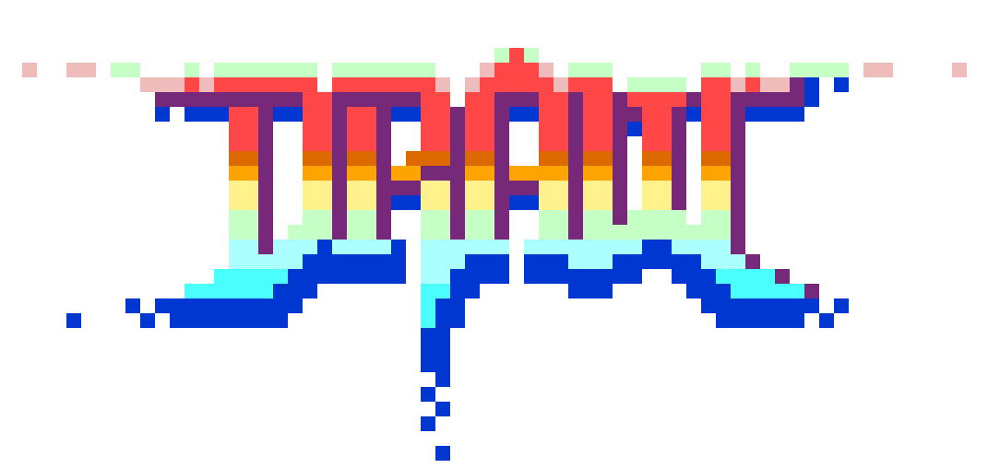

<div align="center">



# DRAW — User Manual

### A pixel art editor written in QB64-PE — that exports your artwork as QB64 source code.

**Version 0.33.0** · Manual revision 2026-04-26

By Rick Christy ([grymmjack](https://github.com/grymmjack)) · [github.com/grymmjack/DRAW](https://github.com/grymmjack/DRAW) · MIT License

</div>

---

## About this Manual

This manual is the companion reference to the DRAW pixel art editor. It mirrors the structure of the upcoming 55-episode video tutorial series and walks you from "I just installed DRAW" through real-world pixel-art workflows, advanced layer techniques, and the quirky touches that only DRAW offers — like exporting your artwork as runnable QB64 source code.

You can read it cover-to-cover, jump to any chapter from the [Table of Contents](#table-of-contents), or use it as a quick-reference once you know your way around. Every chapter ends with practical exercises and every keyboard shortcut you'll see in the manual is also listed in the [appendix](MANUAL/20-appendix.md) and the live [`CHEATSHEET.md`](../CHEATSHEET.md).

### Who this is for

- 🎨 **Pixel artists** moving from DPaint / Aseprite / ProMotion who want a free, open-source, scriptable alternative.
- 🎮 **Game developers** who need fast sprite, tile, and palette workflows with deep export options.
- 💻 **QB64-PE / QBasic enthusiasts** who appreciate that the whole editor — and its native export format — is BASIC code.
- 🆕 **Newcomers to pixel art** who want a guided walkthrough rather than a feature dump.

### Conventions used in this manual

| Convention | Meaning |
| --- | --- |
| `Ctrl+S` | Press the keys together. On macOS, `Ctrl` is `⌘ Cmd` unless the manual says otherwise. |
| `B` | Press a single key (no modifier). |
| `[ ]` | Brackets around a key reference (often used for brush size keys). |
| **Click** / **Right-click** / **Middle-click** | Mouse buttons L / R / M. |
| **Drag** | Press and hold the left mouse button while moving. |
| 🎯 *Goal* | What you'll be able to do after the section. |
| 🎨 *Try it* | A short, practical exercise. |
| 💡 *Tip* | Something useful but optional. |
| ⚠️ *Gotcha* | Something that commonly trips people up. |
| 📸 *Screenshot needed* | A visual that hasn't been captured yet — see [SCREENSHOTS.md](MANUAL/SCREENSHOTS.md) for the production checklist. |

### Chapter emoji legend

The chapter emojis match the DRAW XMind feature mindmap so that visual learners can navigate by glyph as well as by number.

🎬 Intro · 🖌️ Drawing · 🎨 Color · 📚 Layers · ✂️ Selection · 🔄 Transforms · 📝 Text · 📐 Grid & Symmetry · 🪄 Brushes · 💾 Files · 🖥️ Canvas · ⚙️ Settings · 🔊 Audio · 🔍 Analyzer · 🖼️ Reference · ⌨️ Shortcuts · ↩️ Undo · 🎓 Workflows · 💡 Tips · 📋 Appendix

---

## Table of Contents

1. [🎬 Introduction & Setup](MANUAL/01-introduction.md) — what DRAW is, how to install it, and a 5-minute UI tour.
2. [🖌️ Core Drawing Fundamentals](MANUAL/02-drawing-fundamentals.md) — brush, dot, lines, shapes, polygons, fills, spray and eraser.
3. [🎨 Color & Palette Mastery](MANUAL/03-color-palette.md) — FG/BG, color picker, mixer, 56 built-in palettes, palette ops.
4. [📚 Layer System Deep Dive](MANUAL/04-layers.md) — 64 layers, opacity, 19 blend modes, groups, symbols.
5. [✂️ Selection & Clipboard](MANUAL/05-selection-clipboard.md) — marquee, freehand, wand, copy/cut/paste, stroke selection.
6. [🔄 Transforms & Image Adjustments](MANUAL/06-transforms-adjustments.md) — flip, rotate, scale, transform overlay, color correction.
7. [📝 Text System](MANUAL/07-text.md) — fonts, rich text, text layers, character mode.
8. [📐 Grid, Symmetry & Drawing Aids](MANUAL/08-grid-symmetry.md) — 4 grid geometries, 3 symmetry modes, angle snap, crosshair.
9. [🪄 Custom Brushes & Drawer Panel](MANUAL/09-brushes-drawer.md) — capture, transform, recolor, 30-slot drawer, dithering.
10. [💾 File I/O & Export](MANUAL/10-file-io.md) — open/save, the `.draw` format, 9 export formats, sprite extraction.
11. [🖥️ Canvas & View Controls](MANUAL/11-canvas-view.md) — zoom, pan, preview window, tile mode, reference image.
12. [⚙️ UI Customization & Settings](MANUAL/12-settings.md) — settings dialog, theming, panel docking.
13. [🔊 Audio — Music & Sound Effects](MANUAL/13-audio.md) — SFX bank, tracker music, customization.
14. [🔍 Pixel Art Analyzer](MANUAL/14-analyzer.md) — find and fix orphans, jaggies, banding, pillow shading, doubles.
15. [🖼️ Reference Image & Import](MANUAL/15-reference-import.md) — tracing, oversized image import, Aseprite/PSD support.
16. [⌨️ Keyboard Shortcuts & Command Palette](MANUAL/16-shortcuts.md) — 200+ commands at your fingertips.
17. [↩️ Undo, Redo & History](MANUAL/17-history.md) — the unified history system, text-local undo, fearless experimentation.
18. [🎓 Real-World Pixel Art Workflows](MANUAL/18-workflows.md) — game sprites, tileable textures, isometric, mandalas, ANSI art.
19. [💡 Tips, Tricks & Advanced Techniques](MANUAL/19-tips.md) — 10 time-savers, advanced layer techniques.
20. [📋 Appendix — Quick Reference](MANUAL/20-appendix.md) — full cheat sheet, 56 palettes, 19 blend modes.

---

## How this manual is organized

```
docs/
├── MANUAL.md            ← this cover + master TOC
└── MANUAL/
    ├── 01-introduction.md       … 20-appendix.md
    ├── SCREENSHOTS.md   ← capture checklist for missing visuals
    └── images/          ← captured screenshots + placeholder.svg
```

If you are reading this on GitHub, every chapter link above will jump straight to the rendered chapter file. If you are reading offline in VS Code, open the Markdown preview (`Ctrl+Shift+V`) on this file and the entire manual is one click away.

---

## Contributing & feedback

DRAW and this manual are open source. If you find a mistake, want to add a workflow, or simply want to send a screenshot from the [SCREENSHOTS.md](MANUAL/SCREENSHOTS.md) checklist, please open an issue or pull request on the [GitHub repository](https://github.com/grymmjack/DRAW). Thank you for reading — now go make something pixelated.

— *grymmjack*
