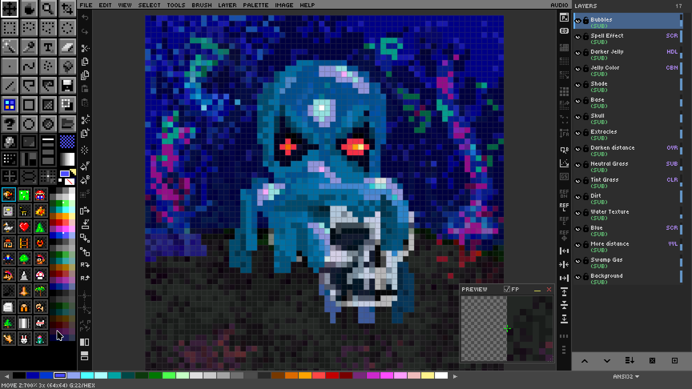
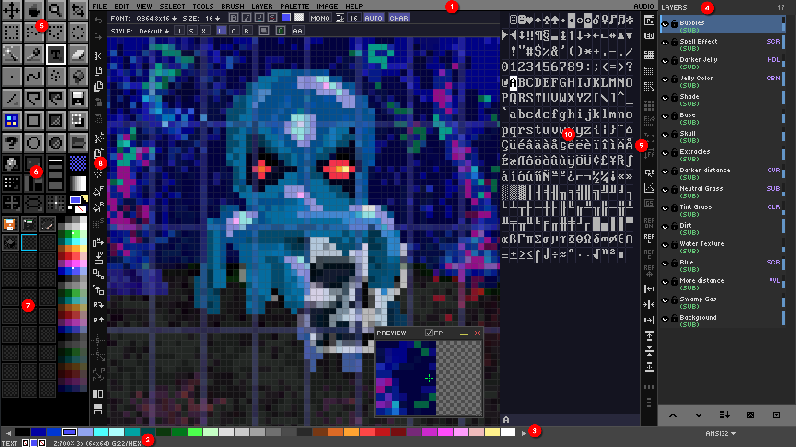
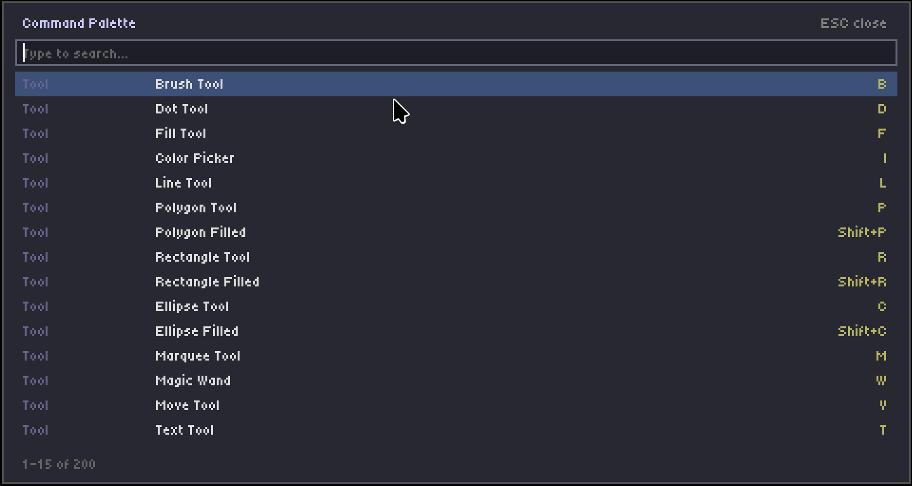

# Ch. 01  🎬 Introduction & Setup

> **What you'll learn:** What DRAW is, why it exists, how to install or build it on Windows / Linux / macOS, and how to find your way around the interface in five minutes.

---

## What Is DRAW?

> 🎯 **Goal:** Understand what DRAW is and why it exists.

DRAW is a pixel art editor written entirely in [QB64-PE](https://github.com/QB64-Phoenix-Edition/QB64pe) — a modern reimagining of Microsoft's QuickBASIC compiler. That alone would make it a curiosity. What makes it genuinely different is its signature party trick: **DRAW can export your pixel art as runnable QB64 source code**. Open the resulting `.bas` file in any text editor, hit compile, and your sprite is reborn as a self-contained BASIC program that draws itself pixel by pixel.

The project takes its inspiration from the legends of the genre — Electronic Arts' **Deluxe Paint** (DPaint), Cosmigo's **ProMotion**, and the spiritual heirs that followed. If you grew up with Amiga art, DOS demoscene tools, or the modern Aseprite, DRAW will feel familiar within seconds.

DRAW is **cross-platform** (Windows, Linux, macOS), **open source** (MIT licensed), and **dependency-free** at runtime — once it's built, you have a single executable plus its `ASSETS/` folder. It ships with **64 layers**, **19 blend modes**, a complete **text system** with rich formatting, **theming**, **audio**, **custom brushes**, and **symmetry drawing**. Its native `.draw` file format is a regular PNG file with a custom embedded chunk, so any image viewer can preview your art even though no other application can re-edit it. You don't need to save your file as .draw.png or .draw, as it recognizes draw files automatically.

<div align="center">
  
</div>

<div class="page-break"></div>

## Getting DRAW — Download, Build & Install

> 🎯 **Goal:** Get DRAW running on your machine.

There are two paths to a working install: **download a pre-built release** (recommended for almost everyone) or **build from source** (recommended if you want to hack on DRAW itself).

### Option A — Pre-built release

Visit the [DRAW Releases page](https://github.com/grymmjack/DRAW/releases) and grab the archive that matches your platform. Each release ships as a self-contained zip containing the `DRAW` executable, the entire `ASSETS/` tree, and a default `DRAW.cfg`. There are no separate library installs, no runtime dependencies, and no internet connection required for normal operation.

### Option B — Build from source

You will need the QB64-PE compiler (from [github.com/QB64-Phoenix-Edition/QB64pe](https://github.com/QB64-Phoenix-Edition/QB64pe)). You need v4.4+. Once it is installed and on your `PATH`:

```bash
git clone https://github.com/grymmjack/DRAW.git
cd DRAW
qb64pe -w -x -o DRAW.run DRAW.BAS
```

The repository also ships a `Makefile` with shortcuts (`make`, `make clean`, `make run`).

### Platform-specific setup

- **Linux** — the `INSTALL/` folder contains a `.desktop` file and MIME-type registration for the `.draw` format so you can double-click `.draw` files in your file manager and have them open in DRAW.
- **Windows** — an installer registers the application in the Start Menu and associates `.draw` with the executable in the Registry.
- **macOS** — run `INSTALL/install-mac.command` once; it copies the app bundle into `/Applications` and sets up Launch Services associations.

### First launch

On first run, DRAW probes your monitor with `_DESKTOPWIDTH`/`_DESKTOPHEIGHT` and chooses a sensible **display scale** (1× through 8×) and **toolbar scale** (1× through 4×). It writes a fresh `DRAW.cfg` next to the executable. That file is plain text — you can hand-edit it any time, and you can override the defaults entirely with `--config /path/to/your.cfg`.

<div class="page-break"></div>

## Your First 5 Minutes — UI Tour

> 🎯 **Goal:** Navigate the interface confidently.

When DRAW launches you'll see six always-visible regions. From top to bottom and outside in:

| Region | Purpose |
| --- | --- |
| **Menu bar** | 11 menus from File through Audio. |
| **Toolbar** | A 4×7 grid of 28 tool icons on the left. |
| **Canvas** | The drawing surface, centered. |
| **Layer panel** | Stack of layers on the right. |
| **Palette strip** | The current palette across the bottom. |
| **Status bar** | Coordinates, zoom, current tool, grid state. |

A second tier of **hidden panels** can be summoned on demand:

- **Organizer Widget** — brush presets and toggles.
- **Drawer Panel** — 30 reusable brush / pattern / gradient slots.
- **Edit Bar** (`F5`) — quick edit actions.
- **Advanced Bar** (`Shift+F5`) — 26+ toggles.
- **Preview Window** (`F4`) — magnifier or floating image.
- **Character Map** (`Ctrl+M`) — 16×16 glyph grid for text-mode work.

Every dockable panel can be flipped to the opposite side with **Ctrl+Shift+Click** on its title or icon area. `F11` toggles *all* UI for distraction-free drawing; `Ctrl+F11` keeps only the menu bar; `Tab` toggles the toolbar alone.

> DRAW GUI Annotated  


1. Menu Bar
2. Status Bar
3. Palette Strip
4. Layer Panel
5. Tool Box
6. Organizer
7. Drawer Bins
8. Edit Bar
9. Advanced Bar
10. Character Map

The single most important keystroke to remember on day one is `?` — that opens the **Command Palette**, a fuzzy-searchable list of every command in the app. If you can't remember a shortcut, type a few letters and hit Enter.

<div align="center">
  
</div>

➡️ Next: [Chapter 2 — Core Drawing Fundamentals](02-drawing-fundamentals.md)
