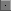
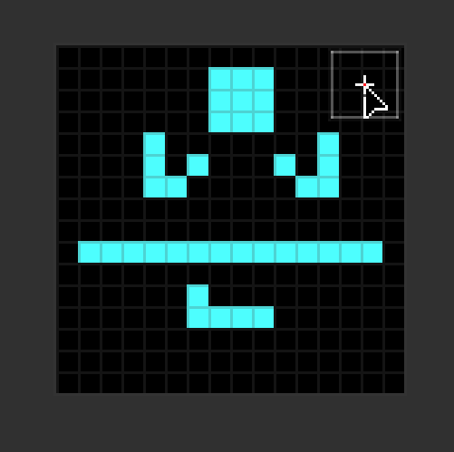
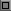
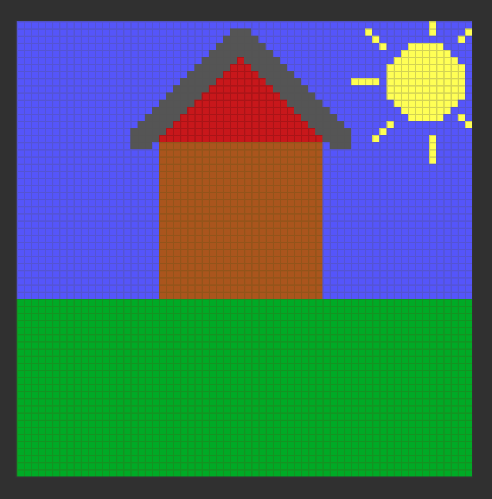
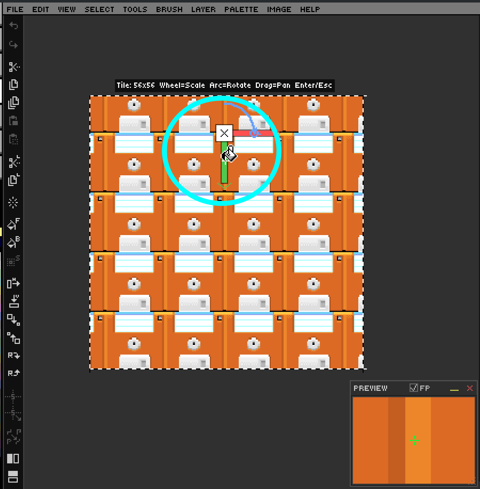
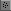
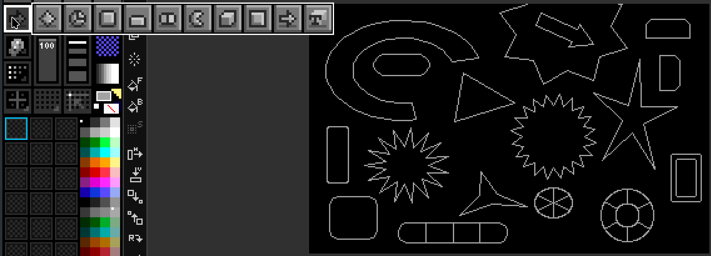

# Ch. 02  🖌️ Core Drawing Fundamentals

> **What you'll learn:** Free-hand brushwork, geometric shapes, polygons, the flood-fill tool, the spray can, and the eraser — the seven tools that account for 90% of pixel art.

---

## Brush, Dot & Freehand Drawing

> 🎯 **Goal:** Master basic freehand pixel drawing.

The two beginner tools you'll meet first are the **Brush** (`B`) for freehand strokes and the **Dot** (`D`) for single-pixel placement. Both share the same brush size and shape state.

| Tool | Icon | Key | Behaviour |
| --- | :---: | :---: | --- |
| Brush |  | `B` | Drag to paint a continuous stroke. |
| Dot |  | `D` | Click to stamp one pixel (or one brush footprint). |

**Brush size** runs from 1 to 50 pixels and is adjusted with `[` (smaller) and `]` (larger). The **brush shape** toggles between circle and square with `\`. To preview the current footprint and color before committing, hold the backtick key (`` ` ``).

DRAW follows the universal "left = foreground, right = background" convention. **Left-click paints with the FG color**, **right-click paints with the BG color**. Holding `Shift` while drawing constrains the stroke to a perfectly horizontal or vertical axis. Holding `Shift` and right-clicking draws a **connecting line** from the previous click to the current position — invaluable for stitching together long straight lines without ever touching the Line tool.

If you have a steady hand but find that single-pixel stairsteps creep into your strokes, enable **Pixel Perfect mode** with `F6`. DRAW will retroactively remove L-shaped corners as you draw, leaving cleaner outlines.

The Organizer widget on the left contains **four brush size presets** (1, 3, 5, 9 pixels for sprite work).

> 🎨 **Try it — your first 16×16 sprite**
> 1. `Ctrl+N` for a new canvas at 16×16 pixels.
> 2. Press `D` for the Dot tool, set size to 1 with `[`.
> 3. Sketch out the silhouette of a simple character.
> 4. Switch to `B` (Brush), increase to size 2, and fill the larger regions.
> 5. Save as `.draw` so you can come back later.

## Lines, Rectangles & Ellipses

> 🎯 **Goal:** Draw clean geometric shapes.

When freehand stops being precise enough you reach for the geometric trio. All three respect the current brush size, color, and symmetry settings.

| Tool | Icon | Outlined | Filled |
| --- | :---: | :---: | :---: |
| Line |  | `L` | — |
| Rectangle |   | `R` | `Shift+R` |
| Ellipse / Circle |   | `C` | `Shift+C` |

**Tip:** While dragging any shape, hold SPACE to move the entire shape with the mouse instead of resizing it. Release SPACE to resume resizing from the new anchor. This works for all geometric and Smart Shape tools, and honors grid snap.

The shared modifier vocabulary across all three:

- **Shift** — constrain (line: H/V; rect: square; ellipse: circle).
- **Ctrl** — perfect aspect (forces square / circle even after you start dragging).
- **Ctrl+Shift while drawing the rect or ellipse** — anchor from the *center* instead of the corner.
- **Ctrl+Shift while drawing a line** — angle snap to 15°/30°/45°/90° increments.

> 🎨 **Try it — house in 30 seconds**
> 1. Filled rectangle for the body. `Shift+R`
> 2. Two lines forming the roof triangle. `L`
> 3. Filled circle (the sun). `Shift+C`
> 4. A few short lines for the sun's rays. `L`
> 5. Filled rectangle for the ground. `Shift+R`

## Polygons & the Fill Tool

> 🎯 **Goal:** Draw complex shapes and fill regions.

The **Polygon** tool comes in two flavours: outlined (`P`) and filled (`Shift+P`). Each click adds a vertex to the in-progress polygon; press `Enter` to close and commit. As with the line tool, **Ctrl+Shift** snaps the segment angle.

The **Flood Fill** tool (`F`, ) pours the FG color into every pixel contiguous with the click point that shares its starting color. By default it samples only the active layer; hold `Shift` to sample from the **merged visible composite** (useful when you have outlines and fills on separate layers).

DRAW's flood fill is unusual in two ways:

1. It supports **custom brushes as a tiled fill** — if you have a brush captured (Chapter 9), the fill is rendered as a seamless tiling of that brush rather than a flat color.
2. It also honours the **paint mode** — set Pattern or Gradient mode (Chapter 9) and your fill becomes a dithered gradient or tiled pattern instead of a solid color.

Press `F8` to enable **Fill Adjustment overlay**. Now when you fill using pattern mode or gradient mode, or with custom brushes in color mode (loaded from the bins), drag the canvas to reposition the tile origin, mouse-wheel for uniform scale, drag the L-handle for independent X/Y scaling, and drag the rotation handle (small arc) to rotate the tile. `Enter` applies, `Esc` cancels.

> 🎨 **Try it — tileable pattern fill**
> 1. Draw a small 8×8 motif.
> 2. Capture it as a custom brush (see Chapter 9).
> 3. On a fresh layer, flood-fill a large rectangle with the brush active.
> 4. Press `F8` and experiment with scale, rotation, and offset.

## Spray Tool & Eraser

> 🎯 **Goal:** Use spray-can effects and clean up mistakes.

The **Spray** tool (`K`, ) emits randomized dots within a circular nozzle. The nozzle radius **doubles for every brush-size step**, and density scales with radius — small brush = pinpoint mist, large brush = thick coverage. Spray respects custom brushes too: every "drop" stamps the brush instead of a single pixel, which is wonderful for foliage, dust, and confetti.

The **Eraser** (`E`, ) paints fully transparent pixels — it does not paint with the BG color, it removes alpha. Two non-obvious tricks make it indispensable:

- **Hold `E` to temporarily eraser anything** while a different tool is active. Release `E` to return to your previous tool. This is the fastest way to nudge an outline or clean a stray pixel.
- **Smart Erase** (`Shift` while erasing) operates on **all visible layers at once**, with per-layer history tracking so each layer's undo step is independent.

The eraser uses your current brush size, shape, and even custom-brush stamp. The status bar shows `FG:TRN` to remind you transparent painting is active.

> 💡 **Tip:** Combine the eraser with a layer's **Opacity Lock** (Chapter 4) to clean up overpaint while preserving the layer's silhouette.

---

## Smart Shapes & Advanced Tools

> 🎯 **Goal:** Draw parametric shapes, 3D dice, and advanced curves.

### Smart Shapes Tool Group

The **Smart Shapes** tool group is accessed from the toolbar. **Long-press or right-click** the Smart Shapes button to open a flyout menu and pick a sub-tool. Each shape has live drag-time arrow-key tweaks and unique modifiers.

**Tip:** While dragging any Smart Shape, hold SPACE to move the entire shape with the mouse instead of resizing it. Release SPACE to resume resizing from the new anchor. Grid snap is honored.

**Sub-tools:**

---

### Smart Shapes — Detailed Controls & Behaviors

The idea of smart shapes is that you begin drawing, then use keys to modify the shape as you create it. All smart shapes snap to the grid and honor grid/symmetry settings, just like regular rectangles and ellipses.

Below are the controls and behaviors for each smart shape:

#### Polygon
> Minimum sides: 3, Maximum: 30

Draws a regular polygon. While dragging, use:
- **Up arrow**: Add edges
- **Down arrow**: Remove edges
- **Left arrow**: Decrease point/star depth (makes a star/burst)
- **Right arrow**: Increase point/star depth

#### Pie / Donut
> Create pie charts or donut shapes with equidistant or custom slices. Left/right arrows add a hole (donut mode).
> Minimum slices: 0, Maximum: 30. Max hole radius: 90% of shape size.

- **Up arrow**: Add segments
- **Down arrow**: Remove segments
- **Left arrow**: Decrease hole size
- **Right arrow**: Increase hole size

#### Rounded Rectangle
> Rectangle with rounded corners. Corner radius can be 1 (almost square) up to 30 (fully rounded), but never so large that corners intersect.

- **Up arrow**: Increase corner radius
- **Down arrow**: Decrease corner radius

#### Tab
> Rounded rectangle with one flat edge. Flat edge can be cycled to any side (top, bottom, left, right).

- **Up arrow**: Round top corners more
- **Down arrow**: Round top corners less
- **Left arrow**: Cycle flat edge left
- **Right arrow**: Cycle flat edge right

#### Pill
> Capsule/oval with dividers for options (like a segmented control). Horizontal by default.

- **Up arrow**: Increase roundness
- **Down arrow**: Decrease roundness
- **Left arrow**: Decrease segments
- **Right arrow**: Increase segments

#### Pac-Man
> Pie chart with a single slice cut out (the mouth). Mouth can be opened/closed. Inner hole for dial/knob effects.

- **Up arrow**: Increase mouth size
- **Down arrow**: Decrease mouth size
- **Left arrow**: Decrease inner hole
- **Right arrow**: Increase inner hole

#### 3D Cube / 3D Polygon (Dice)
> Draws a 3D cube or polyhedral dice wireframe. Press number keys while dragging for dice types: 4 = D4, 6 = D6, 8 = D8, 0 = D10, 1 = D12, 2 = D20, 3 = D30.

- **Up arrow**: Increase Z-depth
- **Down arrow**: Decrease Z-depth
- **Left arrow**: Rotate left
- **Right arrow**: Rotate right
- **Mouse wheel up**: Rotate up
- **Mouse wheel down**: Decrease Z-depth (angle)

#### Bevel Rect
> Rectangle with beveled (angled) edges. Bevel and border size adjustable. Can switch between inner/outer bevel.

- **Up arrow**: Increase bevel size
- **Down arrow**: Decrease bevel size
- **Left arrow**: Decrease border size
- **Right arrow**: Increase border size
- **I**: Switch to inner bevel
- **O**: Switch to outer bevel
- **Mouse wheel up**: Increase Z-depth (angle)
- **Mouse wheel down**: Decrease Z-depth (angle)

#### Arrow
> Arrow with adjustable stem and head. Head can be made concave/curved.

- **Up arrow**: Make stem fatter
- **Down arrow**: Make stem skinnier
- **Left arrow**: Make arrow head shorter
- **Right arrow**: Make arrow head longer
- **Mouse wheel up**: Increase head concavity
- **Mouse wheel down**: Decrease head concavity

---

- **Right-click drag** — solid mode (BG color fill, FG color wireframe)

- Dice type: `4`/`6`/`8`/`0`/`1`/`2` for D4/D6/D8/D10/D12/D20

### Bezier Curve Tool (`Q`)

- `Escape` — cancel

### Line Tool — End Caps

While dragging the Line tool, press `s` / `e` to cycle the start / end cap shape (none → arrow → diamond → circle → square → ...). End caps render in the same FG color as the line.
---

➡️ Next: [Chapter 3 — Color & Palette Mastery](03-color-palette.md)
