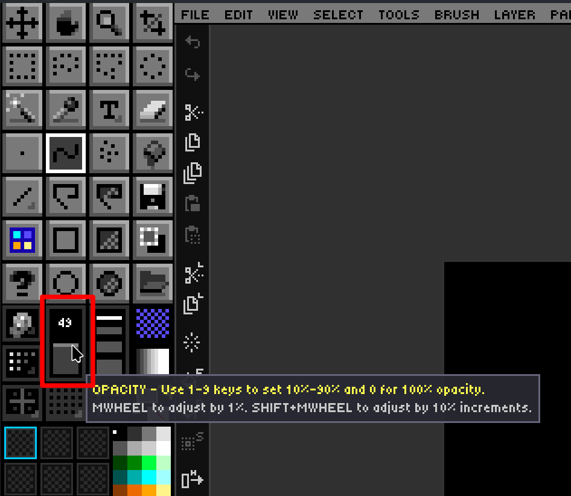
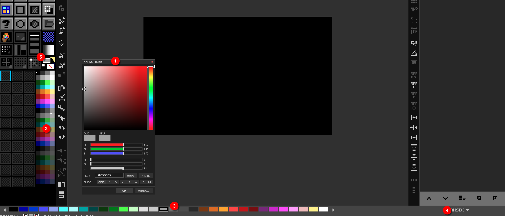
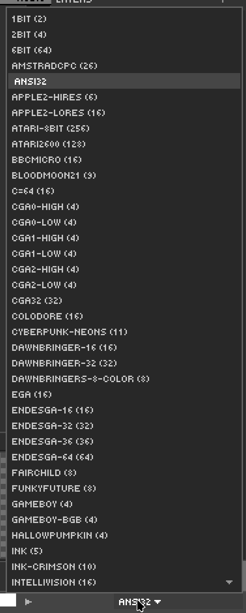

# Ch. 03  🎨 Color & Palette Mastery

> **What you'll learn:** How DRAW thinks about color, the FG/BG/swap dance, the Color Picker and live Color Mixer, the 56 bundled palettes, and the palette-ops mode that lets you remap entire compositions in seconds.

---

## Color Basics — FG, BG & Palette Strip

> 🎯 **Goal:** Select, swap, and manage colors.

The palette strip across the bottom of the screen is the fastest way to choose colors. **Left-click a swatch** to set the foreground (FG) color; **right-click a swatch** to set the background (BG) color. The active FG and BG swatches are echoed in the status bar.

| Action | Key / mouse |
| --- | --- |
| Swap FG and BG | `X` |
| Reset to white FG / black BG | *Palette menu → Default Colors* |
| Set BG to transparent | `Shift+Delete` |
| Scroll the palette strip | Mouse wheel over strip |
| Fast-scroll 32 colors at a time | `Shift` + Mouse wheel |
| Temporary FG eyedropper (any tool) | `Alt`+Left-click on canvas |
| Temporary BG eyedropper (any tool) | `Alt`+Right-click on canvas |

**Paint opacity** — the keys `1` through `9` set strokes to 10–90% opacity, and `0` returns to fully opaque 100%. DRAW uses **per-stroke compositing**, which means a 50% stroke that overlaps itself does not get *more* opaque the way Photoshop's brush would; the stroke is rendered once at the end as a single 50% pass. This makes for predictable, pixel-art-friendly results.

### The Opacity Slider
Use the opacity slider in the organizer of the toolbox to set whatever opacity level you wish from 1% to 100%.

  

| Action | Key / mouse |
| --- | --- |
| Set Opacity from 10% to 100% | `1-9` for 10% to 90%, or `0` for 100% opacity |
| Mouse Wheel Up | Increase opacity by 1% |
| Mouse Wheel Down | Decrease opacity by 1% | 
| `Shift` + Mousewheel | Increase or decrease opacity by 10% |

> Opacity slider will be outlined in a bright color if you set opacity to `<=` the percentage according to `DRAW.cfg` setting: `OPACITY_WARN_THRESHOLD`

## Color Picker, Color Mixer & Custom RGB

> 🎯 **Goal:** Use the full RGB color picker and the live Color Mixer.

Click either the FG or BG swatch in the status bar to open the **Color Picker**. It supports true 24-bit RGB selection plus a hex input field. The Picker tool (`I`) on the canvas pairs an eyedropper with a **loupe overlay** that magnifies the area under the cursor and prints the RGB and hex values for the pixel you'd sample.

The **Color Mixer panel** is a floating, persistent alternative to the modal picker. Open it from `View → Color Mixer` (or via the Command Palette). It exposes:

- RGB sliders — adjust Red, Green, Blue independently.
- HSV sliders — adjust Hue, Saturation, Value.
- A hex input field — paste any hex value directly.
- FG and BG swatches — click to apply the mixed color.

Because the mixer is non-modal, you can keep it open while drawing and tweak colors live. Its visibility is persisted in `DRAW.cfg`.

### 3D Color Space — OKLab, CIELAB, XYZ & RGB

`View → 3D Color Space` opens a floating panel that shows every color your screen can display (the sRGB gamut) as a 3D solid. Different color spaces arrange those same colors differently:

- **OKLAB** (default): a perceptual space (Björn Ottosson, 2020). Equal distances look like equal differences to your eye. It looks like a tilted droplet with black at the bottom and white at the top.
- **LAB**: CIELAB (1976), the classic perceptual space.
- **XYZ**: the CIE 1931 space that all the others are defined from.
- **RGB**: the familiar RGB cube, standing on its black-white diagonal.

How to use it:

- **Left-click or left-drag on the solid** to pick the color under the cursor. It becomes your FG color, and what you see is exactly what you get.
- **Right-drag or middle-drag**, or left-drag on empty space, to spin the view. The **wheel** zooms.
- **SOLID / CLOUD** switches between the gamut's surface and a grid of color dots through the whole volume.
- **SLICE** cuts the solid at a lightness you set with the slider. The cut face shows every color at that lightness, so interior colors become pickable.
- The readout below the view shows the hovered (or current) color in hex/RGB, OKLab, OKLCh, CIELAB and XYZ.

The panel auto-hides while you draw over it and is included in `F11` (hide/show all UI). The space, view, slice, rotation and zoom are remembered in `DRAW.cfg`.

### Perceptual Gradients & OKLCh Ramps

Gradient fills blend in **OKLab** by default (`Settings → Panels → Color Blending + Ramps → Gradient Blend`). Plain RGB blends sag in the middle: red→green passes through a muddy olive. OKLab passes through a clean yellow-orange instead. Choose *sRGB (classic)* for the old behavior, *Linear light* for physically mixed light, or *Pigment (paint)* to blend like mixed paint (see below).

`Palette → Generate OKLCh Ramp from FG` turns the FG color into a new palette: an evenly spaced dark-to-light ramp of the same hue. It's saved under your *Created* palettes as `Ramp RRGGBB` and selected straight away. The same Settings section controls the number of colors, the darkest and lightest lightness, a hue shift at the ends (warmer lights and cooler darks), and how much color the ends keep.

### Pigment Mixing — Mix Brush & Mix Palettes

Light mixes additively, so on a screen blue + yellow makes gray. Paint mixes *subtractively*: each pigment absorbs part of the spectrum, so blue + yellow paint makes green. DRAW models paint with **Kubelka–Munk** pigment mixing, using a port of [Spectral.js](https://github.com/rvanwijnen/spectral.js).

- **`Brush → Mix Colors (Pigment)`** turns on the mix brush. While it's on, Brush strokes mix with the colors already on the layer: blue over yellow paints green, and blue over red paints a deep brown. Empty pixels get the plain color.
  - **Mix Strength** is how much of the mix is your paint. 100% means plain paint; lower values let more of the color underneath through.
  - **Mix Pickup** makes the brush soak up the colors it passes over and drag them along, like wet paint (0% = off).
  - Both live in `Settings → Panels → Color Blending + Ramps`.
  - The eraser and custom brushes don't mix.
  - Undo works as for any stroke.
- **`Palette → Generate Pigment Mix FG > BG`** makes a palette that mixes the FG color into the BG color like paint. It's saved under *Created* palettes as `Mix RRGGBB-RRGGBB`. The number of colors comes from the *Ramp Colors* setting. The BG can't be transparent.
- The *Pigment (paint)* gradient blend (above) applies the same mixing to gradient fills.

> DRAW's various color widgets and doo-dads
> 
> 1. Color Mixer — `View → Color Mixer`
> 2. Mini Palette — Always visible as part of Tool Box
> 3. Color Strip — Can be hidden, shows (4) Palette
> 4. Palette Picker — Choose a palette for editing
> 5. Active Foreground (FG) and Background (BG) colors

## Palette Management — 56 Built-in Palettes

> 🎯 **Goal:** Switch, browse, and manage palettes.

DRAW ships with **56 palettes** in [GIMP's `.gpl` format](https://docs.gimp.org/en/gimp-concepts-palettes.html). They live under `ASSETS/PALETTES/` and include classics — **NES**, **PICO-8**, **Commodore 64**, **Game Boy**, **Endesga 32/64**, **DawnBringer 16/32**, **AAP-64**, **Sweetie 16**, **Resurrect 64**, **CGA**, **EGA**, **VGA**, **Amiga**, **MSX** — plus 40 more.

Click the palette name above the strip to open the dropdown. **Pressing a letter** while the dropdown is open jumps to the next palette starting with that letter — handy when you know the name but not the position.

Palette workflows DRAW supports natively:

- **Download from Lospec** — DRAW can fetch palettes from [Lospec's online database](https://lospec.com/palette-list) directly.
- **Create palette from existing image** — distill the unique colors of any open image into a new palette.
- **Import / Export `.gpl`** — interchange with GIMP, Aseprite, Krita.
- **Remap existing artwork** — recolor a finished piece into a different palette while preserving structure.

  

## Palette Ops — Edit Colors Directly

> 🎯 **Goal:** Modify palette colors and remap on canvas.

**Palette Ops mode** is one of DRAW's signature features. Toggle it from the Organizer panel. Once active, the palette strip becomes editable *and the canvas is remapped live as you change the palette*.

| Gesture on a palette swatch | Effect |
| --- | --- |
| Double-click | Open color picker; new color is **substituted on the canvas** wherever the old one appeared. |
| Right-click | Place a marker / indicator on the swatch (visual bookmarking). |
| Middle-click | Delete the color and remap matching pixels to the nearest remaining color. |
| `Shift`+Middle-click | Insert a transparent (alpha 0) entry at this index. |
| Drag onto another swatch | Rearrange palette order. |
| Left-click | Magic-wand select all matching pixels on the active layer. |

When you first enter Palette Ops, DRAW automatically creates a **`[DOCUMENT]` palette** that snapshots the current state. This means experimentation is safe — you can hop back to the original palette at any time without losing your remapping.

> 🎨 **Try it — colorway exploration**
> 1. Open a finished sprite.
> 2. Toggle Palette Ops.
> 3. Double-click each palette swatch in turn and shift the hue.
> 4. Compare colorways. When one feels right, exit Palette Ops to bake it in.

---

➡️ Next: [Chapter 4 — Layer System Deep Dive](04-layers.md)
