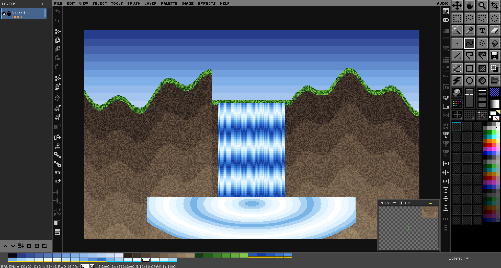

# Ch. 03  🎨 Color & Palette Mastery

> **What you'll learn:** How DRAW thinks about color, the FG/BG/swap dance, the Color Picker and live Color Mixer, the 56 bundled palettes, and the palette-ops mode that lets you remap entire compositions in seconds.

---

## Color Basics — FG, BG & Palette Strip

> 🎯 **Goal:** Select, swap, and manage colors.

The palette strip across the bottom of the screen is the fastest way to choose colors. **Left-click a swatch** to set the foreground (FG) color; **right-click a swatch** to set the background (BG) color. The active FG and BG swatches are echoed in the status bar.

| Action | Key / mouse |
| --- | --- |
| Swap FG and BG | `X` |
| Reset to white FG / black BG | *Palette menu → Default Colors* |
| Set BG to transparent | `Shift+Delete` |
| Scroll the palette strip | Mouse wheel over strip |
| Fast-scroll 32 colors at a time | `Shift` + Mouse wheel |
| Temporary FG eyedropper (any tool) | `Alt`+Left-click on canvas |
| Temporary BG eyedropper (any tool) | `Alt`+Right-click on canvas |

**Paint opacity** — the keys `1` through `9` set strokes to 10–90% opacity, and `0` returns to fully opaque 100%. DRAW uses **per-stroke compositing**, which means a 50% stroke that overlaps itself does not get *more* opaque the way Photoshop's brush would; the stroke is rendered once at the end as a single 50% pass. This makes for predictable, pixel-art-friendly results.

### The Opacity Slider
Use the opacity slider in the organizer of the toolbox to set whatever opacity level you wish from 1% to 100%.

  

| Action | Key / mouse |
| --- | --- |
| Set Opacity from 10% to 100% | `1-9` for 10% to 90%, or `0` for 100% opacity |
| Mouse Wheel Up | Increase opacity by 1% |
| Mouse Wheel Down | Decrease opacity by 1% | 
| `Shift` + Mousewheel | Increase or decrease opacity by 10% |

> Opacity slider will be outlined in a bright color if you set opacity to `<=` the percentage according to `DRAW.cfg` setting: `OPACITY_WARN_THRESHOLD`

## Color Picker, Color Mixer & Custom RGB

> 🎯 **Goal:** Use the full RGB color picker and the live Color Mixer.

Click either the FG or BG swatch in the status bar to open the **Color Picker**. It supports true 24-bit RGB selection plus a hex input field. The Picker tool (`I`) on the canvas pairs an eyedropper with a **loupe overlay** that magnifies the area under the cursor and prints the RGB and hex values for the pixel you'd sample.

The **Color Mixer panel** is a floating, persistent alternative to the modal picker. Open it from `View → Color Mixer` (or via the Command Palette). It exposes:

- RGB sliders — adjust Red, Green, Blue independently.
- HSV sliders — adjust Hue, Saturation, Value.
- A hex input field — paste any hex value directly.
- FG and BG swatches — click to apply the mixed color.

Because the mixer is non-modal, you can keep it open while drawing and tweak colors live. Its visibility is persisted in `DRAW.cfg`.

### 3D Color Space — OKLab, CIELAB, XYZ & RGB

`View → 3D Color Space` opens a floating panel that shows every color your screen can display (the sRGB gamut) as a 3D solid. Different color spaces arrange those same colors differently:

- **OKLAB** (default): a perceptual space (Björn Ottosson, 2020). Equal distances look like equal differences to your eye. It looks like a tilted droplet with black at the bottom and white at the top.
- **LAB**: CIELAB (1976), the classic perceptual space.
- **XYZ**: the CIE 1931 space that all the others are defined from.
- **RGB**: the familiar RGB cube, standing on its black-white diagonal.

How to use it:

- **Left-click or left-drag on the solid** to pick the color under the cursor. It becomes your FG color, and what you see is exactly what you get.
- **Right-drag or middle-drag**, or left-drag on empty space, to spin the view. The **wheel** zooms.
- **SOLID / CLOUD** switches between the gamut's surface and a grid of color dots through the whole volume.
- **SLICE** cuts the solid at a lightness you set with the slider. The cut face shows every color at that lightness, so interior colors become pickable.
- The readout below the view shows the hovered (or current) color in hex/RGB, OKLab, OKLCh, CIELAB and XYZ.

The panel auto-hides while you draw over it and is included in `F11` (hide/show all UI). The space, view, slice, rotation and zoom are remembered in `DRAW.cfg`.

### Perceptual Gradients & OKLCh Ramps

Gradient fills blend in **OKLab** by default (`Settings → Panels → Color Blending + Ramps → Gradient Blend`). Plain RGB blends sag in the middle: red→green passes through a muddy olive. OKLab passes through a clean yellow-orange instead. Choose *sRGB (classic)* for the old behavior, *Linear light* for physically mixed light, or *Pigment (paint)* to blend like mixed paint (see below).

`Palette → Generate OKLCh Ramp from FG` turns the FG color into a new palette: an evenly spaced dark-to-light ramp of the same hue. It's saved under your *Created* palettes as `Ramp RRGGBB` and selected straight away. The same Settings section controls the number of colors, the darkest and lightest lightness, a hue shift at the ends (warmer lights and cooler darks), and how much color the ends keep.

### Pigment Mixing — Mix Brush & Mix Palettes

Light mixes additively, so on a screen blue + yellow makes gray. Paint mixes *subtractively*: each pigment absorbs part of the spectrum, so blue + yellow paint makes green. DRAW models paint with **Kubelka–Munk** pigment mixing, using a port of [Spectral.js](https://github.com/rvanwijnen/spectral.js).

- **`Brush → Mix Colors (Pigment)`** turns on the mix brush. The brush picks up the colors it crosses and smears them along, mixing them with your paint like wet paint (a smudge model after MyPaint's).
  - Blue dragged through yellow paints green, and through red a deep brown.
  - The brush stays wet: carry it off the paint and it keeps laying down the mixed color for a while.
  - **Smudge** (default 50%) is how much of each dab is the picked-up color. 0% means plain paint; 100% is a pure smudge tool that only pushes existing paint around.
  - **Smudge Length** (default 50%) is how long the brush holds a color. Low values follow the canvas closely; high values drag colors far; 100% keeps the first color picked up.
  - **Smudge Radius** (default 100%) is how big an area under the brush is sampled.
  - The brush samples the layer as it was when you started the stroke.
  - All three are in `Settings → Panels → Color Blending + Ramps`.
  - The eraser and custom brushes don't mix.
  - Pixel-perfect mode and undo work as usual.
- **`Palette → Generate Pigment Mix FG > BG`** makes a palette that mixes the FG color into the BG color like paint. It's saved under *Created* palettes as `Mix RRGGBB-RRGGBB`. The number of colors comes from the *Ramp Colors* setting. The BG can't be transparent.
- The *Pigment (paint)* gradient blend (above) applies the same mixing to gradient fills.

> DRAW's various color widgets and doo-dads
> 
> 1. Color Mixer — `View → Color Mixer`
> 2. Mini Palette — Always visible as part of Tool Box
> 3. Color Strip — Can be hidden, shows (4) Palette
> 4. Palette Picker — Choose a palette for editing
> 5. Active Foreground (FG) and Background (BG) colors

## Palette Management — 56 Built-in Palettes

> 🎯 **Goal:** Switch, browse, and manage palettes.

DRAW ships with **56 palettes** in [GIMP's `.gpl` format](https://docs.gimp.org/en/gimp-concepts-palettes.html). They live under `ASSETS/PALETTES/` and include classics — **NES**, **PICO-8**, **Commodore 64**, **Game Boy**, **Endesga 32/64**, **DawnBringer 16/32**, **AAP-64**, **Sweetie 16**, **Resurrect 64**, **CGA**, **EGA**, **VGA**, **Amiga**, **MSX** — plus 40 more.

Click the palette name above the strip to open the dropdown. **Pressing a letter** while the dropdown is open jumps to the next palette starting with that letter — handy when you know the name but not the position.

Palette workflows DRAW supports natively:

- **Download from Lospec** — DRAW can fetch palettes from [Lospec's online database](https://lospec.com/palette-list) directly.
- **Create palette from existing image** — distill the unique colors of any open image into a new palette.
- **Import / Export `.gpl`** — interchange with GIMP, Aseprite, Krita.
- **Remap existing artwork** — recolor a finished piece into a different palette while preserving structure.

  

## Palette Ops — Edit Colors Directly

> 🎯 **Goal:** Modify palette colors and remap on canvas.

**Palette Ops mode** is one of DRAW's signature features. Toggle it from the Organizer panel. Once it's on, the palette strip becomes editable, and the canvas follows every change you make to the palette.

A swatch works like an entry in an indexed palette: its pixels belong to it. Change the swatch and every pixel of that color on the canvas changes with it.

| Gesture on the palette strip | Effect |
| --- | --- |
| Left-click a swatch | **Select** it (yellow frame). It becomes the foreground color. While it's selected, **any** color change edits the swatch and its pixels live: the Color Mixer, Advanced Color Picker, 3D Color Space, picker tool or hex input. One `Ctrl`+`Z` undoes the whole edit. Half a second after the click, the matching pixels are also wand-selected. |
| Left-click the selected swatch | Deselect it. |
| Left-click an empty part of the strip | Deselect the swatch and clear every marker. |
| `Shift`+Left-click another swatch | **Ramp**: the swatches between the selected one and this one become a smooth blend between the two colors, and their pixels follow. The blend uses the *Gradient Blend* setting. |
| Double-click a swatch | Open the color picker for that swatch. |
| Drag a swatch | Move it to a new position. Dragging a **marked** swatch moves *all* marked swatches together. |
| Right-click, or right-drag across swatches | Mark or unmark them. A drag gives every swatch it passes the same state as the first one. |
| Middle-click a swatch | Delete it and remap its pixels to the nearest remaining color. On a **marked** swatch, this deletes every marked swatch. |
| Middle-drag across swatches | Delete the whole range. It's outlined in red until you release. |
| `Shift`+Middle-click a swatch | Insert the **current foreground color** after it, so you can build a palette straight from the color panels. |

> 💡 **Help card.** In Palette Ops, hover the palette strip for a moment and a **help card** pops up just above the strip, with every gesture in this table drawn as a mouse diagram plus its modifier keys. While color cycling is on, it shows the cycling gestures instead, along with the hovered swatch's range. You can turn the card off or move it to another edge of the canvas area (bottom, top, left or right) in **Settings → General → Help Card**.

Undo and redo, and opening the color panels or the Preview, keep Palette Ops on. Other commands, switching tools, `Esc`, and right-clicking the Organizer button turn it off.

When you first enter Palette Ops, DRAW automatically creates a **`[DOCUMENT]` palette** that snapshots the current state. This means experimentation is safe — you can hop back to the original palette at any time without losing your remapping.

> 🎨 **Try it — colorway exploration**
> 1. Open a finished sprite.
> 2. Toggle Palette Ops.
> 3. Click a swatch, then drag in the Color Mixer to shift its hue. The sprite updates as you drag.
> 4. Compare colorways. When one feels right, exit Palette Ops to bake it in.

## Color Cycling — Animate the Palette

> 🎯 **Goal:** Make art move by rotating palette colors, the way DeluxePaint and GrafX2 do, without redrawing a pixel.

Color cycling turns a run of palette swatches into a loop. While it runs, the colors in that run rotate one step at a time, so every pixel painted with them appears to move. Waterfalls flow, fire rises, chase lights run, and a spiral turns. The pixels never change, only the colors they show. That is why one still picture can carry a whole animation.

  

### Turn it on and off

Press **`Shift`+`Tab`**, or choose **Palette → Cycle Colors**. The status bar shows **`[CYC]`** while cycling runs. The canvas, the Preview window and the palette strip animate together. Press `Shift`+`Tab` again to see the true colors.

Cycling is a **view**: it never changes your layers. Saving, exporting a PNG and flattening all use the real colors. The cycle ranges themselves are saved in the `.draw` file.

### Make a cycle range

A **range** is a run of neighboring swatches, such as chips 16–31. You can have up to 16 ranges, and they can't overlap. A new range replaces any range it overlaps. There are two ways to make one, both in **Palette Ops** mode:

1. **Mark and convert.** Right-click or right-drag the swatches to mark them, then choose **Palette → Color Cycling → Range From Marked Chips**. The range runs from the first marked swatch to the last.
2. **`Ctrl`+drag.** Hold `Ctrl` and left-drag across the swatches. A white band previews the span, and the range is created when you release.

Each range shows as a **band along the bottom of its swatches**:

| Band | Meaning |
| --- | --- |
| Solid | **Forward**: colors move toward higher swatch numbers. |
| Dash-dot | **Reverse**: colors move toward lower swatch numbers. |
| Dashed | **Ping-pong**: colors move forward to the end of the range, then back. |
| Dimmed | The range is **paused** and holds its current step. |
| Red checker | This swatch's color also appears **on an earlier swatch**, so its pixels belong to that swatch and can't cycle (see below). |

Hover any swatch in a range and the status bar reads it out, for example `CYC 2: 32-47 REV 8.0/s`. In Palette Ops with cycling on, the help card above the strip shows the same readout, the gestures below, and this band legend.

### Ranges in Palette Ops (`Ctrl` gestures)

| Gesture on a swatch inside a range | Effect |
| --- | --- |
| `Ctrl`+Left-drag across swatches | Create a new range over the span. |
| `Ctrl`+Left-click | Change direction: Forward → Reverse → Ping-pong. |
| `Ctrl`+Right-click | Pause or resume the range. |
| `Ctrl`+Middle-click | Delete the range. |
| `Ctrl`+Wheel | Change speed through a table from 0.5 to 60 steps/s. Wheel up is faster. |
| `Ctrl`+`Shift`+Wheel | Fine speed control, 5% per notch. |

The same commands are in **Palette → Color Cycling**: *Delete Range*, *Clear All Ranges*, *Change Direction*, *Pause / Resume Range*, *Faster*, *Slower*, *Restart All* and *Check Duplicate Colors*. A menu command acts on the range under the hovered swatch, then the selected swatch, then the foreground color. Every range edit can be undone with `Ctrl`+`Z`. A burst of wheel steps counts as a single undo step.

### What cycles, and what doesn't

- **A pixel cycles when its color exactly matches a swatch inside a range.** This is the Palette Ops rule: a swatch *is* its pixels.
- **Duplicate colors.** When two swatches share a color, the **first** one owns the pixels. A duplicate inside a range gets the red checker band and its pixels don't move. Use **Check Duplicate Colors** to list them, then give each one a slightly different color in Palette Ops.
- **Opacity and blend modes.** A pixel drawn at partial opacity, or changed by a blend mode, no longer matches a palette color exactly, so it doesn't cycle. Paint cycling areas at 100% opacity on Normal layers.
- **Editing the palette.** Ranges follow Palette Ops edits. Deleting a swatch shrinks the range around it, inserting a swatch inside a range grows it, and moving swatches drags the range along when its colors stay together.

> 🎨 **Try it: a waterfall in a minute**
> 1. Pick eight blues that run light → dark → light, and put them next to each other in the palette.
> 2. Paint a waterfall with vertical streaks that step through those blues from top to bottom.
> 3. Turn on Palette Ops, `Ctrl`+drag across the eight blues, and press `Shift`+`Tab`. The water falls.
> 4. `Ctrl`+Wheel over the range to set the speed. Hold `Shift` as well for fine control.
>
> Or open one of the finished scenes in **`SAMPLES/COLOR CYCLING/`**: waterfall, fire, tunnel, marquee, ocean-sunset, pinwheel, candles, hanukkah, halloween, skull, snake, christmas, new-year, valentine and st-patricks.

To share cycling art as a runnable QB64 program, a GrafX2 GIF, an animated GIF or a DeluxePaint LBM, see [Chapter 10 — Color Cycling Formats](10-file-io.md#color-cycling-formats--share-the-motion).

---

➡️ Next: [Chapter 4 — Layer System Deep Dive](04-layers.md)
