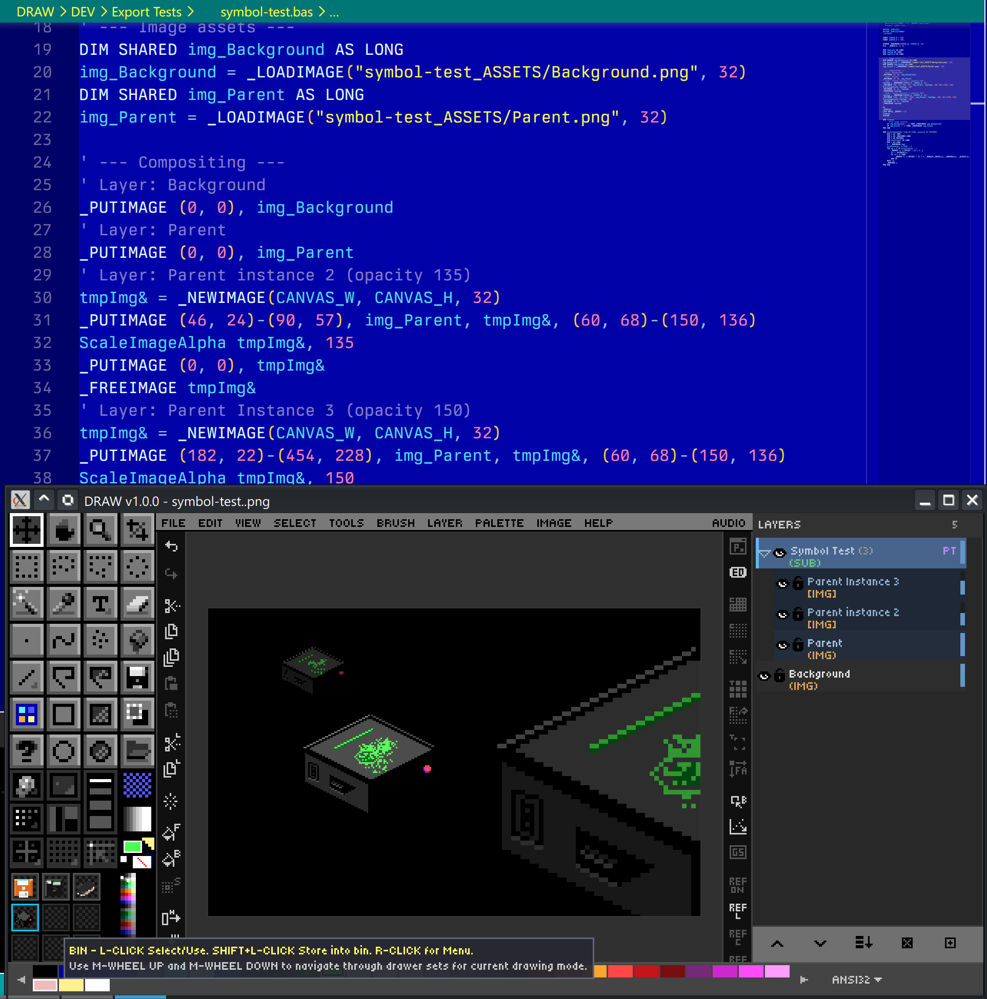

# Ch. 04  📚 Layer System Deep Dive

> **What you'll learn:** How to use DRAW's 64-layer system, opacity and visibility, the 19 blend modes, layer groups, multi-layer selection, alignment, and the unique **symbol layer** system for repeated artwork.

---

## Layer Basics — Create, Delete & Reorder

> 🎯 **Goal:** Work with multiple layers.

DRAW supports up to **64 layers** per canvas. The Layer Panel on the right lists every layer top-to-bottom in render order — top of the list is on top of the canvas.

| Action | Shortcut |
| --- | --- |
| New Layer | `Ctrl+Shift+N` |
| Duplicate Layer | `Ctrl+Shift+D` |
| Delete Layer | `Ctrl+Shift+Delete` |
| Move Up / Down in stack | `Ctrl+PgUp` / `Ctrl+PgDn` |
| Move to top / bottom | `Ctrl+Home` / `Ctrl+End` |
| Rename | Right-click → Rename |

You can also **drag a layer row** with the left mouse button to reorder. **Right-click** any layer for the full context menu (rename, duplicate, delete, group, blend mode, etc.).

> 🎨 **Try it — multi-layer sprite**
> 1. Layer 1: scene/background.
> 2. Layer 2: character outline.
> 3. Layer 3: character base colors (with Opacity Lock — see below).
> 4. Layer 4: highlights and effects.

## Opacity, Visibility & Opacity Lock

> 🎯 **Goal:** Control transparency and protect existing pixels.

Each layer row has three persistent controls:

- **Eye icon** — toggle visibility. **Alt+Click the eye** for **Solo mode**: hide every other layer. Drag horizontally across multiple eye icons to sweep the visibility state.
- **Opacity bar** — drag, or hover and use the mouse wheel, for 0–100%.
- **Lock icon** — **Opacity Lock**. When enabled, drawing tools can only modify pixels that are *already opaque*. Perfect for recoloring within a finalized silhouette without bleeding outside.

> 🎨 **Try it — opacity-locked recolor**
> 1. Draw a character on one layer (transparent background).
> 2. Toggle the lock icon on that layer.
> 3. Take a giant brush and slosh new color over the whole canvas. Notice it only paints inside the silhouette.

## Blend Modes — All 19 Explained

> 🎯 **Goal:** Use blend modes creatively.

A layer's blend mode determines how its pixels combine with the composite below it. DRAW implements all the modes you would expect from a modern raster editor:

| Family | Modes |
| --- | --- |
| **Basic** | Normal · Multiply · Screen · Overlay |
| **Math** | Add (Linear Dodge) · Subtract · Difference |
| **Comparison** | Darken · Lighten |
| **Dodge / Burn** | Color Dodge · Color Burn |
| **Light** | Hard Light · Soft Light · Vivid Light · Linear Light · Pin Light |
| **Color / Difference variants** | Exclusion · Color · Luminosity |
| **Group only** | Pass Through (Chapter 4 / EP15) |

Common pairings:

- **Multiply** — for shadows and ambient occlusion. Multiplying any color by a darker color produces a richer darker color.
- **Screen / Add** — for highlights, glow, fire and lights. Screen is the gentler companion; Add can blow out very quickly.
- **Overlay** — for contrast and saturation boost passes.
- **Color** — apply hue and saturation while preserving the underlying luminosity. The classic photograph-tinting trick.
- **Luminosity** — the inverse: apply brightness while preserving the underlying color.

To cycle a layer's blend mode without opening the dropdown, **`Shift`+Right-click** on the layer row.

> 🎨 **Try it — three-layer lighting study**
> 1. Base sprite on layer 1, Normal mode.
> 2. Layer 2: Multiply mode, paint cool desaturated tones for shadows.
> 3. Layer 3: Screen (or Add) mode, paint warm highlights.

## Layer Groups, Symbols & Advanced Operations

> 🎯 **Goal:** Organize complex artwork.

### Groups

| Action | Shortcut |
| --- | --- |
| Create empty group | `Ctrl+G` |
| Group selected layers | `Ctrl+Shift+G` |
| Ungroup | `Ctrl+Shift+U` |

Groups can be nested arbitrarily and use a special **Pass Through** blend mode that lets each child blend naturally with what's below the group.

### Merge operations

- **Merge Down** — `Ctrl+Alt+E`
- **Merge Visible** — `Ctrl+Alt+Shift+E`
- **Merge Selected** — fold a multi-selection into one layer.
- **Merge Group to Single Layer** — flatten a group while preserving its visual result.

### Multi-layer selection

`Ctrl+Click` toggles individual selection. `Shift+Click` also works like `Ctrl` because Mac users need that. Once multiple layers are selected, every relevant operation — clear, fill, flip, scale, rotate — runs against the whole selection. There is also `Select All in Group`.

### Alignment & distribution

DRAW provides nine alignment commands (Left/Center/Right × Top/Middle/Bottom) and two distribution commands (horizontal, vertical). Combined with multi-layer selection, this is the fastest way to lay out drawn objects in pleasing ways.

### Symbol Layers

A **Symbol Parent** layer can have one or more **Symbol Children**. Drawing on the parent automatically syncs to every child — but each child can be **independently scaled and repositioned**. Use this for repeated elements like coins, enemies, tiles, or recurring UI components.

When you finish a child or want to have a child no longer inherit changes from it's parent:

- **Rasterize** — bake the child into a normal pixel layer (severs the link permanently).
- **Detach** — break the sync but keep the child as an independent layer.

Create them via `Layer → New Symbol Layer` or `Layer → Convert to Symbol`.

  

---

➡️ Next: [Chapter 5 — Selection & Clipboard](05-selection-clipboard.md)
