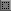
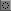
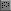
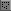

# ✂️ Chapter 5 — Selection & Clipboard

> **What you'll learn:** Every selection tool DRAW offers, how selections clip drawing tools, the full clipboard vocabulary, and the Stroke Selection effect.

---

## Selection Tools — Marquee, Freehand & Wand

> 🎯 **Goal:** Select regions for editing and manipulation.

A selection in DRAW does two things at once: it defines a region for clipboard operations, and it **clips every drawing tool** so paint only lands inside the marching-ants outline.

### Marquee variants

| Variant | Icon | What it does |
| --- | :---: | --- |
| Rectangle |  | Drag to draw a rectangular selection. |
| Ellipse |  | Oval / circular selection area. |
| Freehand |  | Draw the selection boundary by hand. |
| Polygon |  | Click each vertex; close with Enter. |
| Magic Wand |  | Click to select contiguous same-color pixels. |

The shared modifier vocabulary works across **every** selection tool:

- **`Shift`+drag/click** — *add* to the existing selection (union).
- **`Alt`+drag/click** — *subtract* from the existing selection.

After a selection exists you get **resize handles** on its edges; **drag inside the marquee** to translate the selection (with `Move` semantics); **arrow keys** nudge by 1 pixel (10 with `Shift`).

### Magic Wand specials

- `Shift+Click` — add to selection.
- `Alt+Click` — subtract.
- **Hold `F` and click** — instant flood fill with FG, no selection step. This works across ALL layers.
- **Hold `E` and click** — instant erase to transparent. This works across ALL layers.
- **Hold `W` and click** — sample from the merged composite of all visible layers, not just the active one.

### Selection commands

| Command | Shortcut |
| --- | --- |
| Select All | `Ctrl+A` |
| Deselect | `Ctrl+D` |
| Invert Selection | `Ctrl+Shift+I` |
| Expand / Contract | Image / Select menu |
| Selection from current layer | (non-transparent pixels) |
| Selection from selected layers | union mask |

## Copy, Cut, Paste & Clipboard Power

> 🎯 **Goal:** Master clipboard operations.

DRAW has more clipboard verbs than most editors because it cares about both layer-aware and pixel-aware semantics:

| Action | Shortcut | Notes |
| --- | --- | --- |
| Copy | `Ctrl+C` | Selection → clipboard. |
| Cut | `Ctrl+X` | Copy + clear. |
| Paste | `Ctrl+V` | Pastes at the cursor; **auto-engages the Move tool** so you can position before committing. |
| Paste in Place | `Ctrl+Alt+Shift+V` | Paste at the *exact* original position. |
| Copy Merged | `Ctrl+Shift+C` | Copies the visible composite, not just the active layer. |
| Copy to New Layer | `Ctrl+Alt+C` | One-step "duplicate selection onto a new layer above". |
| Cut to New Layer | `Ctrl+Alt+X` | Same, but removes from the source. |
| Paste from OS Clipboard | `Ctrl+Shift+V` | Brings in any image you copied from another application. |
| Clear / Erase | `Ctrl+E` or `Delete` | Clears the selection (or the whole layer if no selection — no prompt). |

### Stroke Selection

`Edit → Stroke Selection` adds a stroke around the selection boundary. You can configure:

- **Width** in pixels.
- **Position** — inside, outside, or centered on the boundary.
- **Color** — current FG, or a custom value.

This is the cleanest way to outline finished sprites in a uniform thickness.

> 📸 **Screenshot needed — stroke selection dialog**
> - **Setup:** Marquee a sprite shape on a transparent layer.
> - **Action:** `Edit → Stroke Selection`. Set Width = 2, Position = Outside.
> - **Capture:** Dialog overlapping canvas, before clicking OK.
> - **Save as:** `images/ch05-stroke-selection.png`

---

➡️ Next: [Chapter 6 — Transforms & Image Adjustments](06-transforms-adjustments.md)
