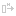
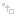

# 🔄 Chapter 6 — Transforms & Image Adjustments

> **What you'll learn:** Quick flips, rotations and scales, the on-canvas Transform overlay (Scale / Rotate / Shear / Distort / Perspective), the Move tool with Smart Guides, and DRAW's image-adjustment dialogs (Brightness/Contrast, Hue/Sat, Levels, etc.).

---

## Quick Transforms — Flip, Rotate & Scale

> 🎯 **Goal:** Transform layers and selections quickly.

These are the no-dialog shortcuts you'll reach for hundreds of times a session.

| Action | Shortcut | Icon |
| --- | --- | :---: |
| Flip Horizontal | `H` |  |
| Flip Vertical | `Ctrl+Shift+H` |  |
| Rotate 90° CW | `>` |  |
| Rotate 90° CCW | `<` |  |
| Scale Up 50% | `Ctrl+Shift+=` |  |
| Scale Down 50% | `Ctrl+Shift+-` |  |

All of the above operate on the active selection if there is one, otherwise on the active layer (or the multi-selected layers). For canvas-level flips that move *every* layer at once, use the corresponding entries under the `Image` menu.

## Transform Overlay — Scale, Rotate, Shear, Distort, Perspective

> 🎯 **Goal:** Use the interactive on-canvas transform tool.

Open it with `Edit → TRANSFORM…` (or via the Command Palette). Note that **Transform is not a toolbar tool** — it's a temporary overlay you commit or cancel.

The overlay supports five modes; switch between them with yhe menu bar items and use the corresponding hotkeys:

1. **Scale** — drag handles. `Shift` locks aspect ratio.
2. **Rotate** — drag *outside* the bounding box. `Shift` snaps to 15° increments.
3. **Shear** — drag the box edges to skew.
4. **Distort** — drag each corner independently.
5. **Perspective** — `Shift` enables a special wall / floor projection.

The overlay frame and handles are themeable in `THEME.CFG`. Press `Enter` to apply (full undo step is recorded), `Esc` to cancel without modifying anything.

> 📸 **Screenshot needed — transform overlay in distort mode**
> - **Setup:** Sprite roughly centered on canvas, selection around it, `Edit → TRANSFORM…`, mode = Distort.
> - **Action:** Pull two corners outward to skew the sprite into a perspective-y trapezoid.
> - **Capture:** Full canvas, overlay frame and four corner handles visible.
> - **Save as:** `images/ch06-transform-distort.png`

## Move Tool & Smart Guides

> 🎯 **Goal:** Reposition layer content precisely.

The **Move** tool (`V`, ) translates the active layer (or multi-selection). Modifiers:

- **Drag** — move.
- **Arrow keys** — nudge 1px (10px with `Shift`).
- **Alt+Drag** — clone stamp; the original stays where it was and the dragged duplicate becomes a new layer.
- **Ctrl+Arrows** — resize.
- **Shift+Click** — auto-select the topmost layer under the cursor.

> Pro-tip: If you have an active selection, you can clone in Selection mode while holding `Ctrl+Alt`

### Smart Guides

When you move a layer, DRAW can render **Smart Guides** — temporary alignment lines that snap to canvas edges, canvas centers, and other layers' edges. This makes pixel-perfect alignment between sprites trivial.

| Toggle | Shortcut |
| --- | --- |
| Show Smart Guides | `Ctrl+Shift+;` |
| Snap to Smart Guides | `Ctrl+;` |

Smart-guide colors and opacity are themeable.

## Image Adjustments — Color Correction & Effects

> 🎯 **Goal:** Apply per-layer color adjustments.

DRAW has two flavors of adjustment: **dialog-based** (with live preview, scrollable parameters) and **one-shot** (instant, undoable).

### Dialog-based (live preview)

- **Brightness / Contrast** — Change the values and intensities of colors.
- **Hue / Saturation** — Rotate the colors on the color wheel and make them more or less colorful.
- **Levels** — Black point, White point, Gamma.
- **Color Balance** — Shadows / Midtones / Highlights.
- **Blur** — Gaussian, adjustable radius.
- **Sharpen** — adjustable intensity.

Hover any slider and use the **mouse wheel** for fine control.

### One-shot

- **Invert** (RGB negative)
- **Desaturate** (luminosity grayscale) (note you can use `Ctrl+Shift+Alt+G` to toggle Gray Scale Mode preview ON or OFF)
- **Posterize** (N levels, with optional dithering)
- **Pixelate** (block size)
- **Remove Background**

Every adjustment **preserves the alpha channel** and is undone in a single `Ctrl+Z`.

> 📸 **Screenshot needed — Levels dialog with histogram**
> - **Setup:** Open a colorful image. `Image → Adjustments → Levels`.
> - **Action:** Drag the gamma slider so the preview is visibly brightened.
> - **Capture:** Dialog with histogram and live preview visible.
> - **Save as:** `images/ch06-levels.png`

---

➡️ Next: [Chapter 7 — Text System](07-text.md)
