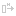
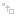
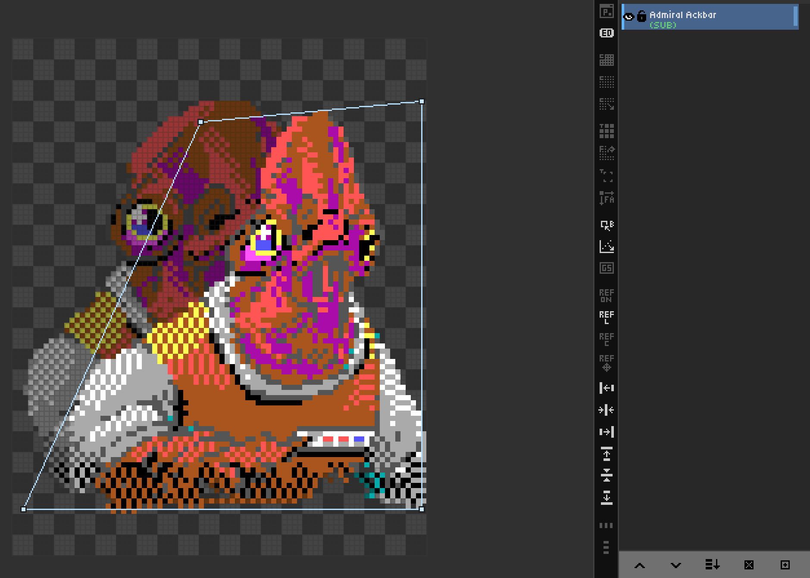
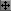
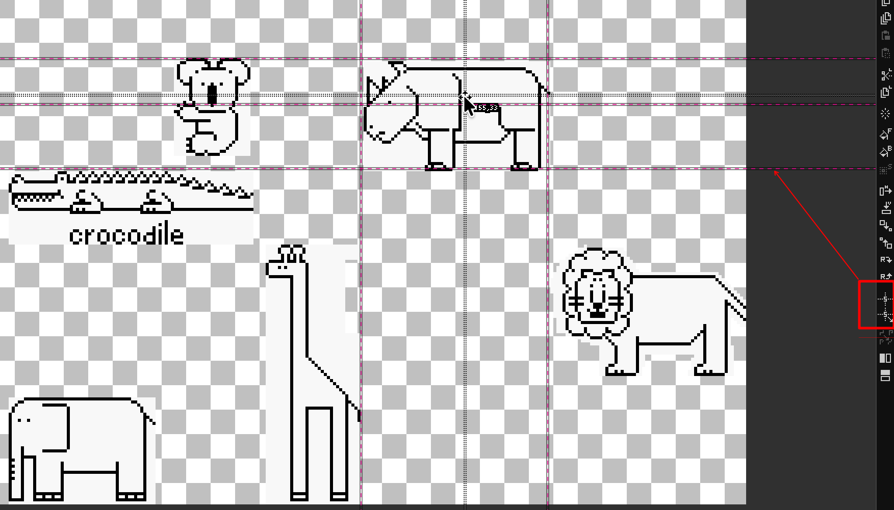

# Ch. 06  🔄 Transforms & Image Adjustments

> **What you'll learn:** Quick flips, rotations and scales, the on-canvas Transform overlay (Scale / Rotate / Shear / Distort / Perspective), the Move tool with Smart Guides, and DRAW's image-adjustment dialogs (Brightness/Contrast, Hue/Sat, Levels, etc.).

---

## Quick Transforms — Flip, Rotate & Scale

> 🎯 **Goal:** Transform layers and selections quickly.

These are the no-dialog shortcuts you'll reach for hundreds of times a session.

| Action | Shortcut | Icon |
| --- | --- | :---: |
| Flip Horizontal | `H` |  |
| Flip Vertical | `Ctrl+Shift+H` |  |
| Rotate 90° CW | `>` |  |
| Rotate 90° CCW | `<` |  |
| Scale Up 50% | `Ctrl+Shift+=` |  |
| Scale Down 50% | `Ctrl+Shift+-` |  |

All of the above operate on the active selection if there is one, otherwise on the active layer (or the multi-selected layers). For canvas-level flips that move *every* layer at once, use the corresponding entries under the `Image` menu.

## Transform Overlay — Scale, Rotate, Shear, Distort, Perspective

> 🎯 **Goal:** Use the interactive on-canvas transform tool.

Open it with `Edit → TRANSFORM…` (or via the Command Palette). Note that **Transform is not a toolbar tool** — it's a temporary overlay you commit or cancel.

The overlay supports five modes; switch between them with yhe menu bar items and use the corresponding hotkeys:

1. **Scale** — drag handles. `Shift` locks aspect ratio.
2. **Rotate** — drag *outside* the bounding box. `Shift` snaps to 15° increments.
3. **Shear** — drag the box edges to skew.
4. **Distort** — drag each corner independently.
5. **Perspective** — `Shift` enables a special wall / floor projection.

The overlay frame and handles are themeable in `THEME.CFG`. Press `Enter` to apply (full undo step is recorded), `Esc` to cancel without modifying anything.

  

## Move Tool & Smart Guides

> 🎯 **Goal:** Reposition layer content precisely.

The **Move** tool (`V`, ) translates the active layer (or multi-selection). Modifiers:

- **Drag** — move.
- **Arrow keys** — nudge 1px (10px with `Shift`).
- **Alt+Drag** — clone stamp; the original stays where it was and the dragged duplicate becomes a new layer.
- **Ctrl+Arrows** — resize.
- **Shift+Click** — auto-select the topmost layer under the cursor.

> Pro-tip: If you have an active selection, you can clone in Selection mode while holding `Ctrl+Alt`

### Smart Guides

When you move a layer, DRAW can render **Smart Guides** — temporary alignment lines that snap to canvas edges, canvas centers, and other layers' edges. This makes pixel-perfect alignment between sprites trivial.

| Toggle | Shortcut |
| --- | --- |
| Show Smart Guides | `Ctrl+Shift+;` |
| Snap to Smart Guides | `Ctrl+;` |

Smart-guide colors and opacity are themeable.

  

## Image Adjustments — Color Correction & Effects

> 🎯 **Goal:** Apply per-layer color adjustments.

DRAW has two flavors of adjustment: **dialog-based** (with live preview, scrollable parameters) and **one-shot** (instant, undoable).

### Dialog-based (live preview)

- **Brightness / Contrast** — Change the values and intensities of colors.
- **Hue / Saturation** — Rotate the colors on the color wheel and make them more or less colorful.
- **Levels** — Black point, White point, Gamma.
- **Color Balance** — Shadows / Midtones / Highlights.
- **Blur** — Gaussian, adjustable radius.
- **Sharpen** — adjustable intensity.

Hover any slider and use the **mouse wheel** for fine control.

### One-shot

- **Invert** (RGB negative)
- **Desaturate** (luminosity grayscale) (note you can use `Ctrl+Shift+Alt+G` to toggle Gray Scale Mode preview ON or OFF)
- **Posterize** (N levels, with optional dithering)
- **Pixelate** (block size)
- **Remove Background**

Every adjustment **preserves the alpha channel** and is undone in a single `Ctrl+Z`.

## The EFFECTS Menu — Photoshop / "Eye Candy" Style Effects

> 🎯 **Goal:** Stylize a layer with a large library of filters and generative effects.

Beyond the Image-menu adjustments, DRAW has a dedicated **EFFECTS** menu organized
into **flyout submenu categories** (hover a category to open its list). Every
effect opens a dialog with a **split ORIG / ADJ live-preview loupe**, **mouse-wheel
sliders**, and an **OK / RESET / CANCEL** button row — **RESET** restores that
effect's default parameters. Effects apply per-layer (multi-layer aware), preserve
alpha where appropriate, and undo in a single `Ctrl+Z`.

- **ADJUST →** Gamma, Sepia, Threshold, Colorize, Gradient Map, Solarize, Duotone / Tritone
- **STYLIZE →** Glow, Film Grain, Vignette, Outline / Stroke, Edge Detect (Sobel), Grow / Shrink (dilate / erode), Chromatic Aberration, **Emboss** (with a **Light Angle**), Wind
- **LAYER FX →** **Drop Shadow** (Distance / **Angle** / Softness / Opacity), Perspective Shadow (Length / **Cast Angle**), **Bevel** (Height / Strength / **Light Angle** / Direction), Outer Glow, Inner Glow, Chrome / Metallic
- **DISTORT →** Wave / Ripple, Twirl, Pinch / Bulge (spherize), Kaleidoscope (auto mandala)
- **PIXELATE →** Crystallize, Stained Glass, Mosaic / Tessellate, Extrude, Pointillize
- **NOISE →** Add Noise, Median / Despeckle, Dust & Scratches
- **RENDER →** Clouds, Difference Clouds, Lens Flare, Terrain, Grid (with perspective), Sky (day / night / space)

### SHAPE → (Eye Candy "Shape", 20 effects)

Effects that work off the shape's alpha edge — backlights, glows, shadows, and
elemental overlays: **Backlight, Corona, Cutout, Bevel, Chrome, Extrude, Outer
Glow, Inner Glow, Drop Shadow, Perspective Shadow, Motion Trail, Rust, Snow, Fire,
Smoke, Icicles, Drip, Glass, Electrify, Water Drops.**

### TEXTURE → (Eye Candy "Texture", 15 effects)

Procedural surfaces painted onto the shape, each with a **MIX** slider (0–100) to
blend the texture with the original art instead of replacing it outright: **Wood,
Marble, Brick Wall, Brushed Metal, Weave, Clouds, Swirl, Water Drops, Ripples,
Animal Fur, Texture Noise, Stone Wall, Reptile Skin, Diamond Plate, Lightning.**

> 💡 Effects that draw *outside* the shape (Drop Shadow, Outer Glow, Fire, Smoke,
> Icicles, Drip, Backlight, Corona, Motion Trail, Snow flecks) work best on a
> **transparent layer** so there's room around the artwork — add one with
> `Ctrl+Shift+N`. Effects that use a colour (Backlight, Corona, Inner/Outer Glow,
> Gradient Map, Duotone, Drop/Perspective Shadow) read the current **FG / BG**
> colours.

---

➡️ Next: [Chapter 7 — Text System](07-text.md)
