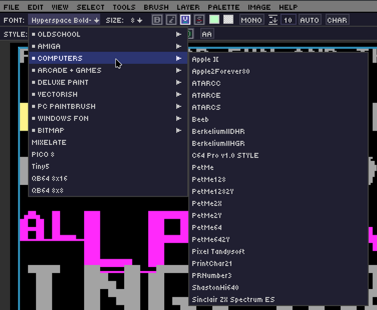

# Ch. 07  📝 Text System

> **What you'll learn:** How DRAW's text tool works, the bundled and custom font support, rich per-character formatting, persistent text layers, and the unique **Character Mode** for ANSI-style art.

---

## Text Tool Basics — Fonts & Entry

> 🎯 **Goal:** Add text to your pixel art.

Press `T` to grab the Text tool, then click on the canvas to drop a text caret. Type to enter characters; `Enter` starts a new line; `Escape` commits the text and exits text-entry mode.

### Bundled fonts

| Font | Shortcut | Description |
| --- | --- | --- |
| VGA | `T` | Classic 8×8 monospace — the iconic DOS look. |
| Tiny5 | `Shift+T` | Minimal 5×5 — perfect for tight UI labels. |
| Custom TTF / OTF | `Ctrl+T`, or Left-Click in the font dropdown | Load any vector font from disk. |

### Bitmap fonts

DRAW ships with **24 color bitmap fonts** in the DPaint-style `.bmp` spritesheet format. Their pixels are preserved verbatim — no antialiasing, no recoloring — at a fixed native height per font. PSF, BDF, and Fontaption formats are also supported.

### The Text Property Bar

When the text tool is active, a property bar appears with the font dropdown, size, and the standard formatting toggles (bold, italic, underline, strikethrough). This bar is fixed in position under the menu bar and not movable or undockable.

  

## Rich Text — Per-Character Formatting

> 🎯 **Goal:** Apply advanced text formatting.

While editing a text layer, every character can carry its own properties. Selection works exactly like a desktop word processor:

| Action | Result |
| --- | --- |
| `Shift`+Arrow | Select characters one at a time. |
| Double-click | Select word. |
| Triple-click | Select line. |
| Quad-click | Select all. |
| `Ctrl+A` | Select all. |

Per-character properties:

- **Bold / Italic / Underline / Strikethrough**
- **Outline** — color + size.
- **Shadow** — color + X/Y offset (1–10px).
- **Per-character FG and BG colors**.
- **Letter spacing** and **line height**.

### Auto-wrap mode and style presets

Auto-wrap reflows the text inside the bounding box. Style presets let you save the entire formatting state of a selection as a named preset and apply it elsewhere with one click — Save / Load / Update / Delete buttons live in the property bar.

### Text-local undo

While in text-entry mode, **`Ctrl+Z` and `Ctrl+Y` operate on a separate 128-state text-local history**. This means typo experiments don't pollute your global history. Sound feedback on each keystroke is configurable in audio settings.

## Text Layers & Character Mode

> 🎯 **Goal:** Master persistent text and ANSI-style art.

### Text layers

Once you commit a text-tool entry, it becomes a **text layer** — fully persisted in `.draw` files and re-editable forever. Click it again with the text tool to resume editing. From the Layer menu you can:

- Rasterize a single text layer (bake it into pixels).
- Rasterize all text layers (one-shot flatten of every text layer).
- Insert a new empty text layer ready for typing.

### Character Mode

Character Mode is for **ANSI / DOS / text-mode art**. Once enabled, the canvas is treated as a grid of cells with a virtual cursor:

> NOTE: DRAW is NOT a full fledged text mode art program, but this is a neat way to make GUI elements!

- Free grid navigation with arrow keys.
- `F1`–`F12` insert ANSI block characters (`░ ▒ ▓ █ ▀ ▄ ▌ ▐`).
- "Font stickiness" — the chosen font follows the cursor as you navigate.
- The DOT and RECT drawing tools fill cells with the current glyph instead of pixels.
- `Alt+U` picks both the FG and BG colors from the character under the cursor.
- A character grid overlay snaps cursor positions cleanly.

### Character Map panel

Open with `Ctrl+M` for a 16×16 grid of all 256 glyphs in the active font.

- Click a glyph to insert it (or use it as a custom brush).
- Dock the panel left or right.
- Toggle Unicode / CP437 mapping with `Ctrl+Shift+U`.

> 📸 **Screenshot needed — Character Map panel**
> - **Setup:** Switch to VGA font, enable Character Mode, open `Ctrl+M`.
> - **Action:** Hover one of the block-shading glyphs (e.g., `▒`).
> - **Capture:** Character Map panel docked right, glyph grid clearly visible.
> - **Save as:** `images/ch07-charmap.png`

> 🎨 **Try it — DOS-style title card**
> 1. Enable Character Mode.
> 2. Pick the VGA font.
> 3. Use `F1`–`F4` to lay block shading along the borders.
> 4. Switch FG/BG colors per cell with `Alt+U` to match an existing color set.

---

➡️ Next: [Chapter 8 — Grid, Symmetry & Drawing Aids](08-grid-symmetry.md)
