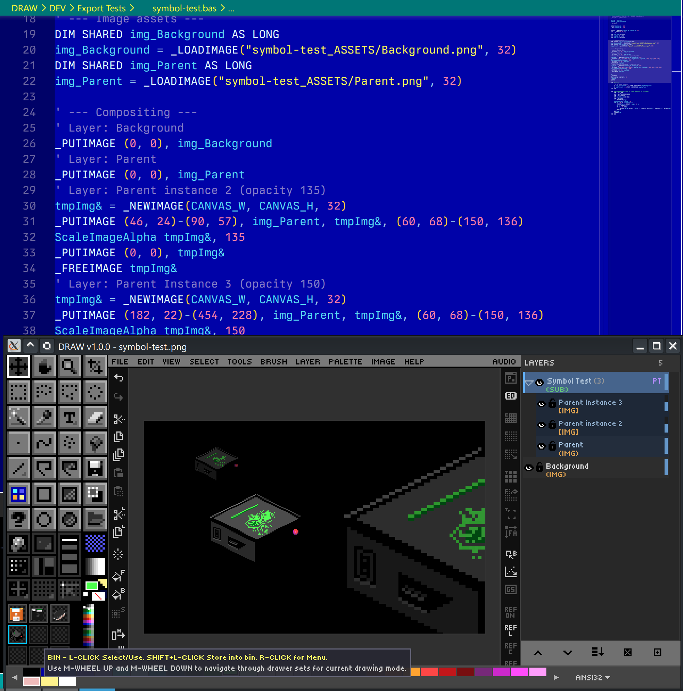
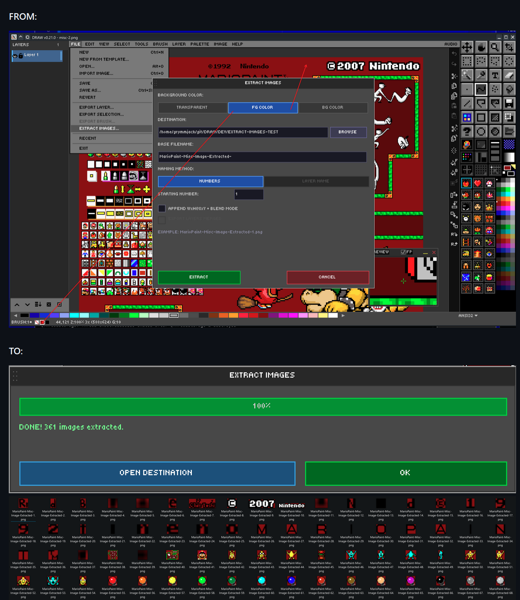

# Ch. 10  💾 File I/O & Export

> **What you'll learn:** Every way to get artwork in and out of DRAW — the native `.draw` format, nine raster export formats, the famous QB64 source-code export, and the Extract Images sprite-decomposition tools.

---

## Opening & Saving — Formats Explained

> 🎯 **Goal:** Understand all file format options.

### Open / Import

| Format | Shortcut / menu |
| --- | --- |
| Image (PNG / BMP / JPG / GIF) | `Ctrl+O` |
| Project (`.draw`) | `Alt+O` |
| Aseprite (`.ase` / `.aseprite`) | File → Open Aseprite |
| Photoshop (`.psd`) | File → Open Photoshop |
| Import Image (oversized, interactive placement) | File → Import Image |
| Drag-and-drop file onto window | Windows |
| Command-line argument | `DRAW path/to/file.draw` |

### Save options

| Command | Shortcut | Notes |
| --- | --- | --- |
| Save | `Ctrl+S` | Silent resave to current path. |
| Save As… | `Ctrl+Shift+S` | Prompt for new name and format. |
| Export Selection | `Ctrl+Alt+Shift+S` | Save just the selected region. |
| Export Layer as PNG | Layer menu | One-click per-layer PNG. |
| Export Brush as PNG | `F12` | Current custom brush. |

The **Recent Files** list holds up to 10 entries with quick-jump shortcuts `Alt+1` … `Alt+0`.

`File → New from Template…` reads from `ASSETS/TEMPLATES/` and gives you a starter canvas with appropriate dimensions, palette, and grid for common targets (NES sprite, Game Boy tile, Lospec sheet, etc.).

## The `.draw` Format — PNG with Superpowers

> 🎯 **Goal:** Understand the native DRAW project format.

A `.draw` file is a **valid PNG file** with a custom `drAw` chunk embedded inside. Every image viewer on the planet can render the flattened preview. Only DRAW can read the rich data inside the chunk and reconstruct the editable project.

What `.draw` preserves:

- All layers, blend modes, opacities, names, groups, symbol parents/children.
- Active palette state and the auto-generated `[DOCUMENT]` palette.
- Tool states, grid settings, snap, crosshair config.
- Reference image configuration and overlay opacity.
- Text layer data (re-editable!).
- Extract Images settings.
- Character Mode state.

The format is versioned for forward compatibility — newer DRAW builds still read older `.draw` files, and they extend the chunk safely when new features arrive.

## Export As — 9 Image Formats

> 🎯 **Goal:** Export artwork in various formats.

| Format | Use case |
| --- | --- |
| **PNG (native `.draw`)** | Embeds the full project in a PNG; viewable anywhere, re-editable in DRAW. |
| **PNG (plain)** | Standard PNG, no metadata. |
| **GIF** | Static, palette-aware. |
| **JPEG** | Lossy compression for previews. |
| **TGA** | Truevision; popular in game dev. |
| **BMP** | Windows Bitmap — for retro tooling. |
| **HDR** | High Dynamic Range. |
| **ICO** | Windows Icon (multi-resolution). |
| **QOI** | Modern lossless [Quite OK Image](https://qoiformat.org/) format. |

### QB64 Source Code Export

The signature feature: export your artwork as a self-contained `.bas` program. The file declares a screen, sets pixels in order, and runs as a standalone QB64-PE compile. Open it, hit compile, and your sprite paints itself onto the screen. This is wonderful for:

- BASIC tutorials.
- Embedding small graphics in QB64-PE programs without shipping image files.
- Showing how a piece of pixel art was constructed pixel by pixel.

  

## ANSI Art — Import & Export

> 🎯 **Goal:** Bring classic ANSI/BBS art into DRAW as pixels, and turn your pixel art into shareable ANSI.

DRAW reads and writes the ANSI-art family of formats, so you can drop lo-fi mockups into DRAW, refine them as pixels, and hand them back out as `.ans`.

### Importing ANSI (**File → Import ANSI…**)

Supported inputs:

| Kind | Extensions | Notes |
| --- | --- | --- |
| **Text ANSI** | `.ans` `.asc` `.nfo` `.diz` | SGR escape sequences — 16-color, **iCE**, **256-color** (`38;5;n`), and **24-bit truecolor** (`38;2;r;g;b`). UTF-8 block/box art is auto-detected and mapped to CP437. |
| **BIN** | `.bin` | Raw character+attribute pairs; width from SAUCE (`BinaryText`). |
| **XBIN** | `.xb` `.xbin` | Full XBIN: custom 16-color palette, embedded font, and RLE compression. |
| **TundraDraw** | `.tnd` | 24-bit truecolor binary stream. |

The **Import ANSI** dialog previews the art and its detected format, and lets you choose how it rasterises onto the canvas:

- **WIDTH** — `8 PX` (square) or `9 PX` (authentic VGA 9-dot; box-drawing characters join across cells).
- **ASPECT** — `SQUARE` or `DOS 1.2` (the classic non-square CRT stretch).
- **SCALE** — `1×`–`8×` nearest-neighbor.
- **Cell height** follows the SAUCE font: `IBM VGA` → 8×16, `VGA50`/`EGA43` → 8×8.

If an **XBIN** carries an embedded **font** or a custom **palette**, the dialog offers to install them into your libraries:

- **Import font** writes the font to `FONTS/ANSI Imports/` so it appears as a bitmap font for the Text tool.
- **Import palette** writes a `.GPL` into your user palettes and refreshes the picker.

You can also open ANSI art straight from the command line: `./DRAW.run artwork.xb`.

### Exporting ANSI (**File → Export ANSI…**)

Export converts the canvas to **half-block** ANSI (each character cell shows two stacked pixels via `▀`). The dialog gives a live source-vs-render preview plus:

| Control | Choices |
| --- | --- |
| **FROM** | `DOCUMENT` (flattened) · `LAYER` (current) · `SELECTION` (marquee region) — auto-selects Selection when one is active |
| **COLOR** | `16` · `iCE` · `256` · `RGB` (24-bit) — auto-detected from the art |
| **CELLS** | `PER-PIXEL` (one canvas pixel per cell — maximum detail) · `1:1 8PX` (one 8-px cell — round-trips terminal art at native size) |
| **FONT** | `VGA 8x16` · `VGA50 8x8` (written to the SAUCE record) |
| **SIZE** | Column count (auto, or stepped) |

A byte-exact **SAUCE** record (dimensions + font) is appended. Use **Selection** as the source to mock a scene in pixels and export just one section to ANSI.

> 💡 **Round-trip tip:** `PER-PIXEL` keeps every pixel but renders ~8× larger in a terminal/viewer; `1:1 8PX` maps 8×16-pixel blocks to one cell, so exported terminal art re-imports at its original size.

## Extract Images — Sprite Sheet Decomposition

> 🎯 **Goal:** Extract sprites from sheets or compositions.

DRAW can decompose a finished image into individual sprite PNGs. Three extraction methods are available:

- **Flood-fill connected regions** — auto-detect distinct sprites by transparent gutters. Best for unsorted sprite sheets.
- **Per-layer extraction** — each layer becomes one PNG. Best when your sheet was built layer-by-layer.
- **Merged extraction** — flatten visible layers and extract regions from the result.

Background options for each output sprite: **Transparent**, **FG color**, or **BG color**. Output is a folder of separate PNG files; the settings you pick are persisted in the `.draw` file so you can re-export later with one click.

There is a related command, **Extract From Grid…**, which slices a regular grid (e.g., 16×16 cells) into named PNGs — perfect for tilesets — and **Extract To Layers From Grid…**, which slices a grid into named *layers* in a new project.

  

---

➡️ Next: [Chapter 11 — Canvas & View Controls](11-canvas-view.md)
