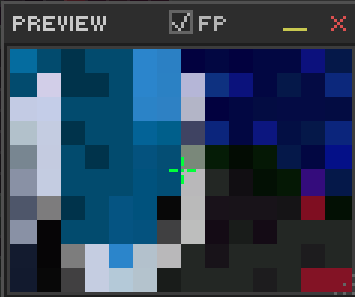
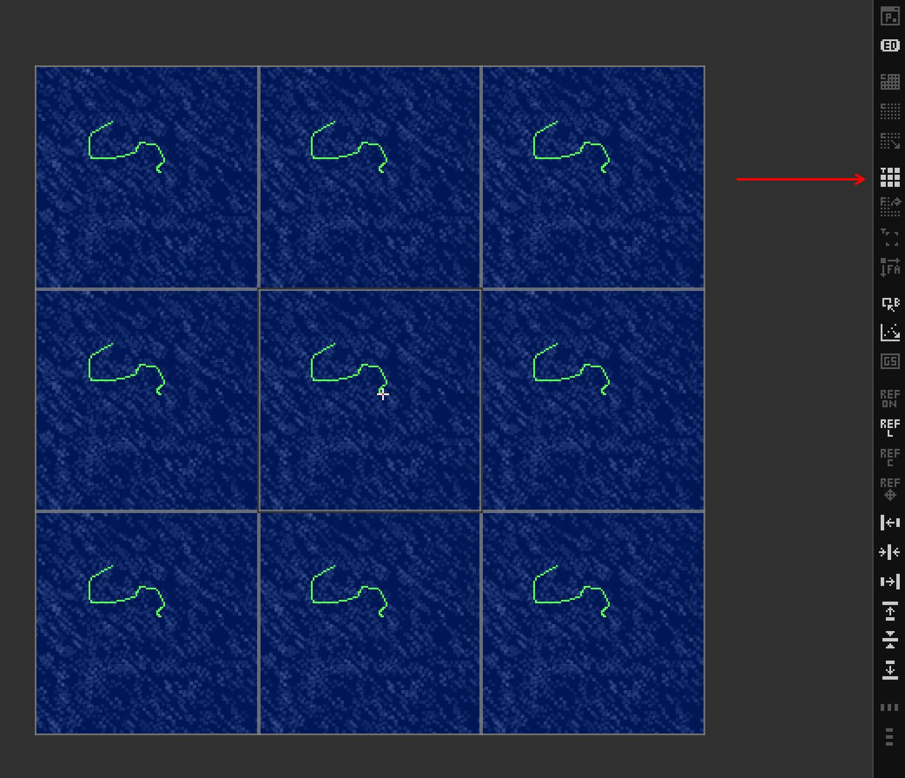

# Ch. 11  🖥️ Canvas & View Controls

> **What you'll learn:** How to navigate any canvas — zoom, pan, the floating Preview Window, pattern-tile preview, reference images, fill / clear shortcuts, and canvas resize / crop.

---

## Zoom, Pan & Navigation

> 🎯 **Goal:** Navigate canvases of any size efficiently.

### Zoom

| Action | Shortcut |
| --- | --- |
| Zoom in/out continuously | `Ctrl`+Mouse wheel |
| Zoom in / out 1 step | `Ctrl+=` / `Ctrl+-` |
| Reset to 100% | `Ctrl+0` |
| Zoom tool | `Z` () |
| Zoom to dragged region | `Z` then drag |
| Zoom out (Zoom tool) | `Alt`+Click |

Zoom snaps to canonical levels: 25%, 50%, 75%, 100%, 200%, 300%, 400%, 600%, 800%.

### Pan

You can pan **with any tool active**, no need to switch:

- Middle-mouse-drag.
- `Spacebar`+drag.
- **Double-middle-click** — instantly resets pan and zoom to fit the canvas.

Scrollbars appear automatically for canvases larger than the viewport. The canvas border (`#`) outlines the edge of the canvas at any zoom.

## Preview Window, Tile Mode & View Options

> 🎯 **Goal:** Use preview and tiling for workflow efficiency.

### Preview Window

`F4` toggles the **Preview Window**, a floating, resizable, repositionable secondary view. It runs in one of three modes:

1. **Follow** — a magnifier that tracks the cursor.
2. **Floating Image** — a static reference display (e.g., the source you're tracing).
3. **Bin Quick Look** — hover any drawer slot to see its content full-size in the preview.

Independent zoom and pan inside the preview, plus **`Alt`+Click to color-pick** without switching tools. The preview also remembers up to 10 recent images for quick swaps.

  

### Pattern Tile Mode

**View → Pattern Tile Mode** (or the tile-mode button in the Advanced Bar) toggles a 3×3 tiled preview (up to 512×512 source). Seams in seamless textures jump out instantly because they appear nine times.

  

### Other view options

- **Grayscale Preview** — `Ctrl+Alt+Shift+G`. Inspect value structure without color distraction.
- **Reference Image** — `Ctrl+R`. See [Chapter 15](15-reference-import.md).

### Canvas fill & clear

- `Delete` — clear (Edit → Clear). Removes the active selection's pixels (or the whole layer if no selection). No prompt.
- `Backspace` — fill with FG color. Instant, no prompt.
- `Shift+Backspace` — fill with BG color. Instant.

### Canvas crop & resize

- **Crop tool** () — interactive with handles; commit with Enter.
- **Image → Canvas Resize…** — dialog with anchor selection and pixel/percent toggle.

---

➡️ Next: [Chapter 12 — UI Customization & Settings](12-settings.md)
