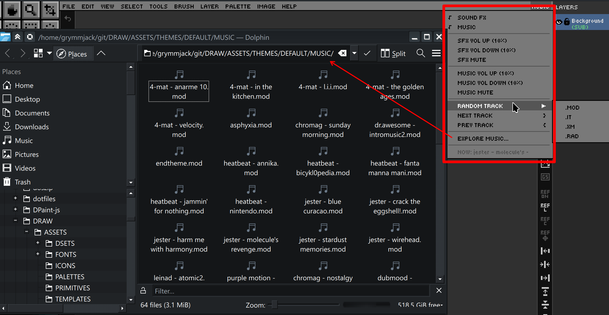

# Ch. 13  🔊 Audio: Music & Sound Effects

> **What you'll learn:** DRAW's per-theme sound effect bank and tracker-music player, plus how to swap, mute, and customize the audio experience — including MIDI playback and SF2 SoundFont configuration.

---

## Audio System — SFX, Music & Customization

> 🎯 **Goal:** Configure the creative audio experience.

### Sound effects (21 categorized slots)

DRAW emits short SFX for distinct UI actions — menus, tools, selection, fill, clipboard ops, layer ops, text entry, sliders, drag-and-drop, and more. The sounds live in the active theme's `SOUNDS/` folder as WAV or OGG files. Replace any file with one of the same name to retheme that action without touching code.

You can:

- Globally enable / disable SFX.
- Adjust master SFX volume.
- Mute (independent of disabling).

### Background music

DRAW plays **tracker** modules and **MIDI** files natively:

| Format | Description |
| --- | --- |
| `.mod` | Amiga ProTracker / FastTracker. |
| `.xm` | FastTracker II Extended Module. |
| `.it` | Impulse Tracker. |
| `.s3m` | Scream Tracker 3. |
| `.rad` | Reality Adlib Tracker. |
| `.mid` / `.midi` | Standard MIDI Format (SMF). |
| `.rmi` | RIFF MIDI (Windows MIDI container). |

The **Audio** menu (rightmost in the menu bar) hosts:

- **Auto-shuffle** — when the current track ends, DRAW picks a random next track from the active music folder.
- **Next track** — `}`
- **Previous track** — `{`
- **Random track** — picks at any time. Use the **Random Track** submenu to restrict by format: `.MOD`, `.IT`, `.XM`, `.RAD`, `.MID`, or `.RMI`.
- **Volume up / down** — ±10% increments, independent of SFX volume.
- **NOW PLAYING** — read-only display of the current track name and format (e.g. `NOW: jester - stardust [MOD]`). Name is truncated to 32 characters.
- **Explore Music Folder** — opens the music directory in your OS file manager.

All audio settings persist in `DRAW.cfg`.

---

## MIDI Playback & SoundFont Configuration

> 🎯 **Goal:** Get the best possible MIDI sound quality.

DRAW uses QB64-PE's built-in **OPL3 FM emulator** for MIDI/RMI playback out of the box — no extra files required. For richer, more realistic MIDI audio you can supply your own **SoundFont2** (`.sf2`) file.

### Configuring an SF2 SoundFont

1. Open **Settings** (Edit → Settings or `Ctrl+,`).
2. Navigate to the **Audio** tab.
3. Scroll to the **MIDI Soundfont** section.
4. Click the `...` browse button to locate a `.sf2` file on your system.
5. Click **Apply** or **OK** — the font is loaded before every MIDI/RMI track.
6. To revert to built-in OPL3 FM synthesis, click the **Clear** button next to the path field.

> **Tip:** Free general-MIDI soundfonts such as *GeneralUser GS* or *SGM-V2.01* work well and are widely available online.

### How MIDI playback works

- `_MIDISOUNDBANK` is called with the SF2 path immediately before `_SNDOPEN` for each MIDI/RMI track.
- If the SF2 path is empty or the file no longer exists, DRAW automatically falls back to the built-in OPL3 emulator.
- The `MIDI_SF2_FILE` key in `DRAW.cfg` stores the path so it persists across sessions.
- Drop `.mid`, `.midi`, or `.rmi` files into `ASSETS/THEMES/DEFAULT/MUSIC/` and they will be included in random-track auto-shuffle alongside tracker modules.

  

---

➡️ Next: [Chapter 14 — Pixel Art Analyzer](14-analyzer.md)
