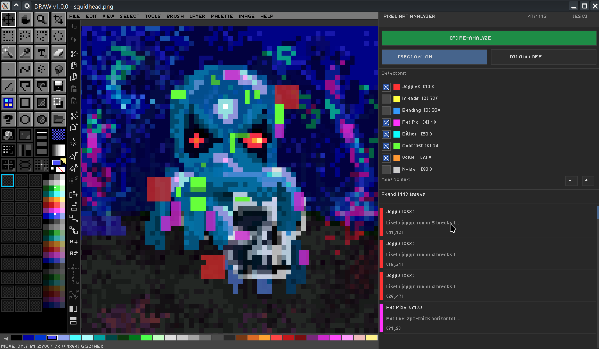

# Ch. 14  🔍 Pixel Art Analyzer

> **What you'll learn:** How DRAW's built-in Pixel Art Analyzer detects the five most common pixel-art mistakes and how to fix each one.

---

## Pixel Art Analyzer — Find & Fix Common Issues

> 🎯 **Goal:** Improve pixel art quality with automated analysis.

The **Pixel Art Analyzer** scans the active layer (or selection) for five well-known pixel-art problems and visualizes each one in an overlay so you can fix them efficiently.

### Detection categories

| Category | What it finds | Why it's a problem |
| --- | --- | --- |
| **Orphan pixels** | Single isolated pixels surrounded by transparency or different-colored pixels. | Visual noise and unintentional speckling. |
| **Jagged lines** | Stairstepped lines with uneven step lengths. | Reads as rough or amateurish; clean stairsteps should be regular. |
| **Banding** | Repeating horizontal/vertical color stripes that should be a smooth gradient. | Looks like a quantization artefact, not intentional shading. |
| **Pillow shading** | Concentric layered shading that follows the silhouette outline. | Produces a "puffed up" 3D effect that ignores light direction. |
| **Doubles** | Two adjacent identical-color pixels along an outline that should be 1px. | Throws off the line weight and stair-step rhythm. |

### How it works

The analyzer uses a precompute engine for fast incremental analysis. After the first scan it caches the per-pixel classifications so re-analysis after a fix is near-instant. Results are presented in an interactive dialog with totals per category and a clickable list that pans/zooms to each occurrence.

> 🎨 **Try it — before/after cleanup**
> 1. Open a sprite that you know is rough.
> 2. Run `Image → Pixel Art Analyzer`.
> 3. Step through orphan pixels first; remove or merge each one.
> 4. Re-analyze. Move to jagged lines next, then doubles, banding, and pillow shading last.
> 5. Save before-and-after copies for your portfolio.

  

---

➡️ Next: [Chapter 15 — Reference Image & Import](15-reference-import.md)
